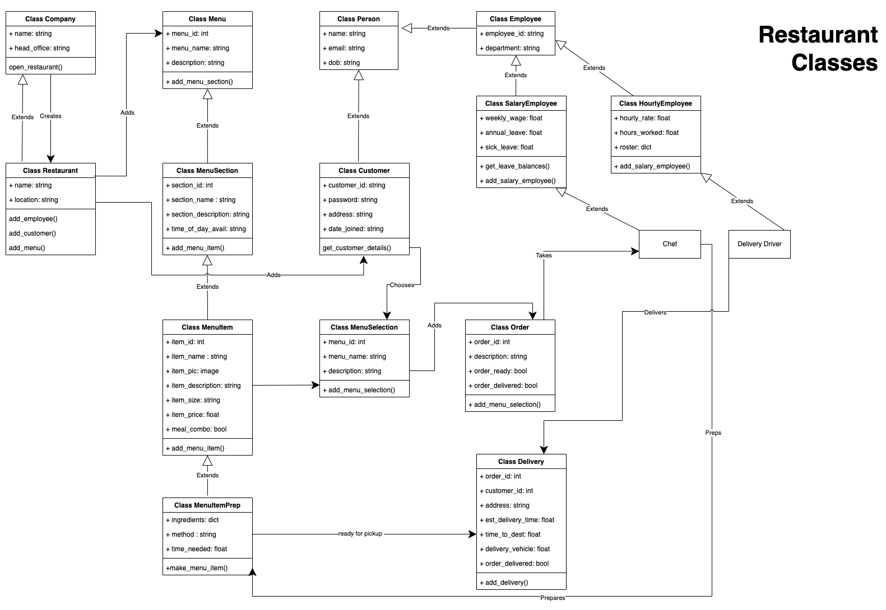
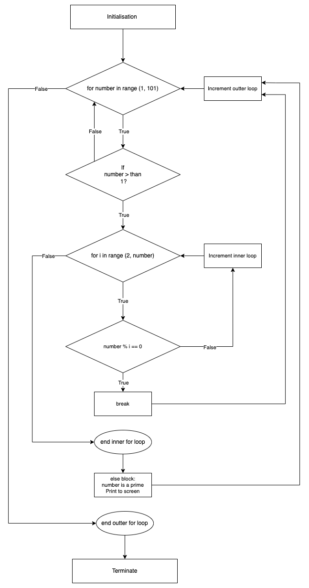

# **Coder Academy - Assignment T1A1 - Workbook: Submitted by Mario Lisbona**

# **Table of contents**

- [**Coder Academy - Assignment T1A1 - Workbook: Submitted by Mario Lisbona**](#coder-academy---assignment-t1a1---workbook-submitted-by-mario-lisbona)
- [**Table of contents**](#table-of-contents)
  - [**Q1 - Web Development Markup Laguages**](#q1---web-development-markup-laguages)
    - [**Tags**](#tags)
    - [**Elements**](#elements)
    - [**Presentational Markup**](#presentational-markup)
    - [**Procedural Markup**](#procedural-markup)
    - [**Descriptive Markup / Semantic Markup**](#descriptive-markup--semantic-markup)
  - [**Q2 - Internet Technologies: Packets, IP, Routers and DNS**](#q2---internet-technologies-packets-ip-routers-and-dns)
    - [Definition - **Packets**](#definition---packets)
    - [Definition - **IP addresses (IPv4 and IPv6)**](#definition---ip-addresses-ipv4-and-ipv6)
    - [Definition - **Routers and Routing**](#definition---routers-and-routing)
    - [Definition - **Domains and DNS**](#definition---domains-and-dns)
    - [Explanation - **Packets**](#explanation---packets)
    - [Explanation - **IP addresses (IPv4 and IPv6)**](#explanation---ip-addresses-ipv4-and-ipv6)
    - [Explanation - **Routers and Routing**](#explanation---routers-and-routing)
    - [Explanation - **Domains and DNS**](#explanation---domains-and-dns)
  - [**Q3 - Internet Technologies: TCP, HTTP/HTTPS and Web Browsers**](#q3---internet-technologies-tcp-httphttps-and-web-browsers)
    - [Definition - **TCP**](#definition---tcp)
    - [Definition - **HTTP and HTTPS**](#definition---http-and-https)
    - [Definition - **Web Browsers (requests, rendering and developer tools)**](#definition---web-browsers-requests-rendering-and-developer-tools)
    - [Explanation - **TCP**](#explanation---tcp)
    - [Explanation - **HTTP and HTTPS**](#explanation---http-and-https)
    - [Explanation - **Web Browsers (requests, rendering and developer tools)**](#explanation---web-browsers-requests-rendering-and-developer-tools)
  - [**Q4 - Python Data Structures**](#q4---python-data-structures)
    - [**Dictionary**](#dictionary)
    - [**List**](#list)
    - [**Set**](#set)
  - [**Q5 - Interpreters and Compilers**](#q5---interpreters-and-compilers)
  - [**Q6 - Pros / Cons of Python and JavaScript**](#q6---pros--cons-of-python-and-javascript)
    - [**Python - Benefits**](#python---benefits)
    - [**Python - Drawbacks**](#python---drawbacks)
    - [**JavaScript - Benefits**](#javascript---benefits)
    - [**JavaScript - Drawbacks**](#javascript---drawbacks)
  - [**Q7 - Ethics and Tech**](#q7---ethics-and-tech)
    - [**Access to a user’s personal information**](#access-to-a-users-personal-information)
    - [**GPS tracking data and other types of data**](#gps-tracking-data-and-other-types-of-data)
    - [**Case Study: GPS tracking data and other types of data - Monitoring spouses with Spyware**](#case-study-gps-tracking-data-and-other-types-of-data---monitoring-spouses-with-spyware)
  - [**Q8 - Control Flow in Python**](#q8---control-flow-in-python)
    - [**Sequential control flow**](#sequential-control-flow)
    - [**Selection control flow**](#selection-control-flow)
    - [**Repetition control flow**](#repetition-control-flow)
      - [**While loop**](#while-loop)
      - [**For loop**](#for-loop)
      - [**Match Case**](#match-case)
  - [**Q9 - Type Coercion and Type Conversion in Python**](#q9---type-coercion-and-type-conversion-in-python)
  - [**Q10 - Data Types**](#q10---data-types)
    - [**Numeric Types**](#numeric-types)
      - [**int**](#int)
      - [**float**](#float)
      - [**complex**](#complex)
    - [**Text Type**](#text-type)
      - [**str**](#str)
    - [**Boolean Type**](#boolean-type)
      - [**bool**](#bool)
    - [**Sequnce Type**](#sequnce-type)
      - [**tuple**](#tuple)
    - [**None Type**](#none-type)
      - [**None**](#none)
  - [**Q11 - Classes**](#q11---classes)
  - [**Q12 - Find the error in a Code Snippet**](#q12---find-the-error-in-a-code-snippet)
  - [**Q13 - Rewrite a Code Snippet to swap two adjacent elements in an list**](#q13---rewrite-a-code-snippet-to-swap-two-adjacent-elements-in-an-list)
  - [**Q14 - Algorithmic Thinking**](#q14---algorithmic-thinking)
    - [**Flow chart - Primer numbers between 1 - 100**](#flow-chart---primer-numbers-between-1---100)
    - [**Pseudocode - Primer numbers between 1 - 100**](#pseudocode---primer-numbers-between-1---100)
  - [Q15 - Python code using comparison and logical operators](#q15---python-code-using-comparison-and-logical-operators)
  - [**Q16 - ACME Corporation - Coding Competency Application**](#q16---acme-corporation---coding-competency-application)
    - [**My Solution**](#my-solution)
  - [**References**](#references)

## **Q1 - Web Development Markup Laguages**

**Identify** and **explain** common and important components and concepts of web development markup languages   

### **Tags**

  Tags wrap the element's content. They signal how the content will be displayed as well as the beginning and end point for that particular element. (Erika Varagouli 2021) [^1]

### **Elements**
  
  Tags indicate where an element starts and ends. An element consists of the tags and the content that is enclosed by those tags. (Erika Varagouli 2021) [^2]

In the html below, the tags are labled section, figure, h4, p, nav and a. The element consists of everything between the opening tag, sourounded by `<>` and the closing tag, sounded by `</>`
```html
<section class="preview-card">
        <figure id="article-preview-pic"></figure>
        <h4>Frontend Mentor project</h4>
        <h4>Article preview with tooltip</h4>
        <p>I found creating the layout on this page a little tricky. It contains a dynamic tool tip that will stay over the arrow when the browser is resized. I adapted the JavaScript from a tutorial on tooltips that i found on YouTube.</p>
        <nav>
          <a href="FEM-Article-preview" target="_blank">Visit the Github repo</a>
          <a href="FEM-Article-preview/" target="_blank">Visit the live site</a>
        </nav>
      </section>
```

### **Presentational Markup**
  
  This is the type of markup used in word processors and is nearly always hidden from the authors, editors and readers of the document. It uses binary codes embedded in documents to affect the text in a process coined WYSIWYG - What You See Is What You Get. (Wikipedia) [^3]

### **Procedural Markup**
  
  With procedural markup, the instructions on how to process the text are embedded in the text itself. Markdown is a great example of this. The document's text is processed from top to bottom and when encountered, the procedural markup is applied to the text it is associated with. (Wikipedia) [^4]

  Below is some markdown text used in the reference section of this document. The `[^1 - Tags](#tags)` will show the text '^ - Tags' with a hyperlink to the Tags section of this document. The `[*What Each Markup Language Is Used For*](https://www.semrush.com/blog/markup-language/)` will show up as 'What Each Markup Language Is Used For'. The text will be italicised, as indicatedby the sourounding **'s. This text will hyperlink to an external webspage.

```md
- [^1 - Tags](#tags) - Erika Varagouli (2021) [*What Each Markup Language Is Used For*](https://www.semrush.com/blog/markup-language/), Semrush website, accessed 25 August 2022.
```

### **Descriptive Markup / Semantic Markup**
  
  This type of markup is used to convey the type of content that is being wrapped by a tag. It helps to convey the purpose of the text being presented.(Erika Varagouli 2021) [^5] Its purpose is to label parts of a document based on what the content is rather than how that content should be presented. (Wikipedia) [^6] Some examples of markup and where they would be used on a webpage ar shown below.

  

  (W3Schools) [^7]

## **Q2 - Internet Technologies: Packets, IP, Routers and DNS**

**Define** the features of the following technologies that are essential in terms of the development of the internet:

### Definition - **Packets**
  
  A packet is the name given to the container that is used to send information around a packet-switched network. It contains two types of information, control information and user data.(Wikipedia) [^8]

### Definition - **IP addresses (IPv4 and IPv6)**
  
  An IP (Internet-Protocol)  address is a unique address that is assigned to any computer or device that is connected to a network. The address is made up of 4 sets of numbers connected (or separated) by full stops. e.g: 142.250.76.100 (MDN) [^9]

### Definition - **Routers and Routing**
  
  Routers are responsible for getting a data packet to its intended destination. Data packets contain the destination IP address amongst other control information. Routing is the process of routers choosing the most efficient path for the data packet to travel from source to destination. (cisco) [^10]

### Definition - **Domains and DNS**
  
  IP addresses can be easily processed by a computer however they are quite difficult to remember for humans. The domain name is a name given to a web server that is connected to the internet. It is essentially an alias for the underlying IP address used to locate that particular web server. DNS stands for Domain Name System. DNS is similar to a registry or database where a web server's IP address is linked to its domain name. (MDN) [^11]

**Explain** how each technology has contributed to the development of the internet.

### Explanation - **Packets**
  
  Packets contributed to the development of the internet by allowing larger chunks of data to be broken up at the server and sent in smaller packets to the user or client. This meant that multiple clients/users could be downloading data from a single website at the same time. This would not be possible if the website had to be downloaded in one large chunk. Having data in small packets rather than large files also makes it easier and more efficient to resend data that is corrupted or lost. (MDN) [^12]

### Explanation - **IP addresses (IPv4 and IPv6)**
  
  Without IP addresses the internet wouldn't exist! Every device, whether it's a phone, tablet, PC or web server is assigned an IP address so that it can be located on the internet. The IP address allows the device to send and receive data to/from other devices. It may be allocated an IP address using either IP4, which uses 32bits for its address and IP6 which uses 128bits.(Wikipedia) [^13]

### Explanation - **Routers and Routing**
  
  Routers are an intermediary device and create a network between the sender and the receiver. They will receive data, in the form of packets, from computer A and know which path to send that data so that it reaches its destination at computer B and not at computer C or D. Routers can also link to other routers and this fact allowed for the massive expansion of the internet. Creating a network of networks allows for a theoretical infinite amount of connections between devices on the internet. (MDN) [^14]

### Explanation - **Domains and DNS**
  
  With an ever increasing number of web servers on the internet, domains and DNS allowed users to access websites with easy to remember groups of words rather than random numbers separated by full stops. This is facilitated by a type of server called a DNS server. This is a server that will translate the human readable domain name that is entered by the user into its associated computer readable IP address and will direct the user to the correct web server. (Amazon) [^15]

## **Q3 - Internet Technologies: TCP, HTTP/HTTPS and Web Browsers**

**Define** the features of the following technologies that are essential in terms of the development of the internet:

### Definition - **TCP**
  
  The Transmission Control Protocol facilitates the connection between two hosts to allow the guaranteed transmission of data and packets in the correct order to the receiver. (MDN) [^16] Its main features are connection control, reliability, flow control and congestion control. (Noction) [^17]

### Definition - **HTTP and HTTPS**
  
  The main features of the Hypertext Transfer Protocol are the client and the server. Requests for information are sent by the client, normally a web browser, to the server. The server then answers the request by sending back information to the client. This is called a response. The client (almost) always is the side sending the request. And the server will then serve the document requested as a response to the client. (MDN) [^18]
Hypertext Transfer Protocol Secure (HTTPS) is the same as HTTP except that it has more security that is provided by an SSL certificate and the SSL protocol. SSL stands for Secure Sockets Layer. (Javatpoint) [^19]

### Definition - **Web Browsers (requests, rendering and developer tools)**
  
  A web browser is a piece of software that is used to access and view data on the internet. It sends requests to web servers for data and once it receives the response, it will render the information as a webpage on the user's device. (Wikipedia) [^20]
  Developer tools are software add-ons that are included with a browser to allow web developers to inspect, test and debug their code. They work with a few different web technologies including HTML, CSS and JavaScript. (Wikipedia) [^21]

**Explain** how each technology has contributed to the development of client and server communication over the internet *(50 - 150 words for each technology)*.

### Explanation - **TCP**
  
  TCP’s ethos on accuracy over timeliness is one of the reasons it has contributed to the development of client-server communication over the internet. TCP can handle extended delays in the delivery of packets and packets that arrive out of order. Examples of how this might occur are when some packets take a different route to their destination or when corrupted packets need to be retransmitted. If timeliness is more important than accuracy then TCP is not the ideal protocol. For applications like VOIP that prioritise timeliness over accuracy, then other protocols such as RTP(Real-time transport Protocol) or UDP (User Datagram Protocol) may be better suited.
  
  TCP guarantees that the data received at the client is the exact data sent by the server. It achieves this accuracy using a technique called ‘positive acknowledgement with retransmission’. This technique involves the receiver sending an acknowledgement to the sender once the packet is received. The sender keeps a log of when a packet is sent and a timer that starts when the packet was sent. If a certain amount of time elapses and the sender has not received an acknowledgment yet, it will resend the packet. (Wikipedia) [^22]

### Explanation - **HTTP and HTTPS**
  
  These technologies have hugley contributed to client-server communication because they allow all the devices connected to the network to communicate with each other without having a permanent connection between the two parties. A network would be very limited in its size if every device needed a permanent connection to every other device for communication.
  When a connection is needed the client sends a request and the server ‘hears’ the incoming request and the connection is established. The server then waits for the request message from the client. The server's response includes the requested information in a HTTP response. The connection can be closed at any time by either the client or the server. (Wikipedia) [^23]

### Explanation - **Web Browsers (requests, rendering and developer tools)**
  
  Web browsers play a vital part in client server communication. They represent the part of the ‘client’ in client-server communication. Client-server networking is an architecture where information is kept in a central location on servers and is shared with many clients in many different locations. The web browsers part as the client in this architecture is to send the requests for information to the server and accept the responses.
  
  The centralised storage of data on servers allowed numerous clients, or web browsers, to access that data at the same time. In addition to receiving the raw information, the browser also renders that information into a webpage that can be easily viewed on a device. (LifeWire) [^24]
  
  Browsers also have addons called developer tools. These have increased developers productivity by allowing them to directly view a website and edit the code locally to see immediately what changes would result from changing the code whether that be the CSS, HTML or JavaScript. Some other tools that assist developers are the ability to access web-page assets and network usage information such as the bandwidth used to load a page and what headers are being sent and received by the browser. JavaScript debugging within a developer tool suite is also commonly used. (Wikipedia) [^25]

## **Q4 - Python Data Structures**

**Identify** THREE data structures used in the Python programming language and **explain** the reasons for using each.

### **Dictionary**
  
Python dictionaries are collections of data that are stored with key/value pairs where the key is immutable (does not change) and the value is mutable (can be changed). This structure makes it useful in the following situations:

- If the data that needs to be stored has a unique reference for the key. An example might be a membership ID, telephone number or email address
- If the order that the data is stored is not important
- When timeliness is crucial in relation to accessing a particular element. Dictionaries are designed to allow fast access to particular data based on the unique key because it means the whole database does not need to be scanned to find the right element. (Erdem Isbilen 2020) [^26]  (Dan Bader 2020) [^27] 

### **List**
  
Python lists are implemented as mutable dynamic arrays. This means that Python lists allow elements to be added and removed. They can store any type of object in python. This makes them highly versatile and the most commonly used data structure in Python and are used for many reasons such as the ones below.

- When a developer needs to store a collection of data that is heterogenous, that is to say when all the data types are different. Python lists can store simple data structures like integers or strings alongside more complex structures like tuples, dictionaries or other lists!
- When the order of the data is important. The order the data is entered into the list is preserved in a list. (Erdem Isbilen) [^28] (Dan Bader 2020) [^29]

### **Set**
  
Python sets are a data structure similar to a dictionary and a list but has its own unique features. A set is an unordered list of entries. They are similar to lsits but a set cannot have duplicate entries and each entry needs to be hashable, that is its value does not change over time. It has a few use cases listed below:

- Checking a set for a value is very fast compared to a list. So if you're looking to store unordered, unique items that have a value that won't change then a set is preferable over a list.
- They are useful for removing duplicates from a series of values
- Sets support mathematical operations being performed on their data. These include intersection, union, difference and symmetric difference. (Python.org) [^30] (Stack overflow) [^31]

## **Q5 - Interpreters and Compilers**

**Describe** the features of *interpreters* and *compilers* and how they are different.

Interpreters and compilers both translate higher level programming languages, or source code, into machine code made up of 0’s and 1’s. Although they have similar features they both use different processes to convert human readable source code into machine readable code.
A compiler will scan the whole program before it translates the source code, as a whole, into machine code. The analysis stage is much longer in duration than that of an interpreter but the overall execution time is faster than interpreters. Compilers require more memory because they create Object Code which requires linking. Common languages that use compilers are C, C++ and Java.


An interpreter will translate a program line by line and will take less time to analyse the source code compared to a compiler. However, it will take more time overal to execute the process. It wont produce any Object Code, so has no need for linking like a compiler, so is more efficient with its memory use. Examples of languages that use interpreters are Python, JavaScript and Ruby. (Programiz) [^32]

## **Q6 - Pros / Cons of Python and JavaScript**

**Identify** TWO commonly used programming languages and **explain** the benefits and drawbacks of each.

### **Python - Benefits**

- Extensive Libraries
  
  Python’s standard library is extensive and comes packed with useful code and functions for regular expressions, documentation-generation, unit-testing, databases, image manipulation and more.

- Extensible and embeddable
  
  Python can be extended to other languages. You can write some of your code, for example, in C or C++.  Complementary to its extensibility, it is also embeddable. This means that python code can be embedded into the source code of other projects, for example, into C++.

- Improved productivity
  
  Python’s extensive libraries give developers access to pre-written functionality that allows them to solve common problems with a few lines of code. This allows more time to be spent on bigger picture problem solving.

- Ease of use and readability
  
  Python’s syntax is less complicated than other languages and it reads much like english, this makes it relatively easy to learn and use.

- Free and Open-Source
  
  Not only is Python free to download and use, but its source code is also available to download, change and distribute.

- Portable
  
  With software written in C or C++ changes may need to be made to make the software run on different platforms. This is not the case with Python as it uses a philosophy called Write Once Run Anywhere(WORA). However developers need to take caution to not use features that are system specific.

- Interpreted rather than compiled
  
  Python’s code is analysed line by line rather than as a whole, which happens in compiled languages. This makes debugging code easier than in compiled languages.

- Object-Oriented
  
  Python supports Object-oriented in addition to procedural programming philosophies. Python's functions help with code reusability. Objects and classes allow developers to model the real world. A class allows developers to combine and encapsulate functions and data.
  
### **Python - Drawbacks**

- Speed limitations

  Because python is interpreted rather than compiled, it executes the code line by line. This can result in slow execution of applications.

- Weak adoption in mobile computing and browsers
  
  Python is popular with server side applications however it is rarely seen used on client side applications because no major web browsers have python built into them. Although python has a framework called Django that can make its interactions with client side applications more streamlined.

- Underdeveloped Database Access Layers
  
  Python's Database Access Layers are fairly undeveloped compared to common technologies like JDBC (Java DataBase Connectivity) and ODBC (Open DataBase Connectivity). This means it has been less readily adopted for larger enterprise projects.

- Design Restrictions - Dynamic Typing
  
  Python is a Dynamically typed language which means that variables are allowed to change over their lifetime and that the interpreter only performs type checking when the code runs. While this is easier and more efficient for the developer when coding it can cause run time issues if the variable types are incorrect. (Data-flair) [^33] (Real Python) [^34]

### **JavaScript - Benefits**

- Speed
  
  As long as no other outside resources are needed, JavaScript runs immediately within the client's browser which makes it very fast to run code. JavaScript also isn't slowed down by calls to a server. All major browsers support Just In Time (JIT) compilation for JavaScript. JIT compilation means the code can be run without it being compiled first.

- Simplicity
  
  JavaScripts syntax is easy to learn and easier to read than other languages like C++

- Popularity
  
  JavaScript is ubiquitous on the web. Its is now becoming more popular as a language to develop applications on servers with the release of Node.js. There is an abundance of projects on Github and StackOverflow that are written in JavaScript and its popularity is only expected to increase.

- Reduces Server Loads
  
  Because javascript is mainly a client side language it greatly reduces the load on servers. There are some cases with smaller applications where a server is not needed at all

- Creation of rich interface
  
  JavaScript has the ability to create a host of features that contribute to webpage useability including drag and drop components and sliders that increase the quality of a user’s experience.

- Versatility
  
  JavaScript, through the use of frameworks and complementary technologies, becomes very versatile. It's possible to create an entire full-stack application with JavaScript. An example of this would be using a Node.js server, bootstrapping Express to Node.js and using MongoDB for a database. In addition to those backend technologies, using JavaScript for the frontend would mean the entire application was created with JavaScript
  
### **JavaScript - Drawbacks**

- Browser interpretations

  Server side scripts will always produce the same result. Different browsers, however, will occasionally interpret JavaScript code differently. These differences aren't huge so problems can be mitigated by testing the application across all the major browsers.

- Client-side Security
  
  Oversights in Javascript code can potentially be exploited by malicious actors because the code is executed within the browser. Because of this design flaw and potential security risk, a lot of people will completely disable JavaScript in their browser. (FreeCodeCamp) [^35]


## **Q7 - Ethics and Tech**

**Identify** TWO ethical issues from the areas below and discuss the extent to which an IT professional is ethically responsible in terms of the issue.

- criminal acts such as theft, fraud, trafficking and distribution of prohibited substances, terrorism
- GPS tracking data and other types of metadata, MAC addresses, hardware fingerprints
- freedom of thought, conscience, speech and the media
- aggressive sales and marketing practices designed to mislead and deceive consumers
- trading of shares on the stock exchange OR crypto-currencies

### **Access to a user’s personal information**

User data is an integral and powerful resource when it comes to technology and its use immensely improves a user’s experiences with technology. There are huge benefits that come with the mass collection of user data,

>“including improved public health, stronger fraud detection, improved efficiencies and processes, relevant advertising, and access to more suitable products”(Phuong Nguyen, Lauren Solomon 2018) [^36] 
 
However this powerful resource comes with widespread challenges and high consequences if it is not handled ethically at any stage of the process from gathering, through to storage and eventual use.
Data ethics are a huge concern to IT professionals. Whether you are directly or indirectly responsible for writing code that gathers user information, or you are managing a database containing the personal and private information of you users, having a broad understanding of data ethics can help you spot unethical data practices or give you tools to avoid it in the first place.
Listed below are 5 data ethics principles that should be taken into consideration whenever you are handling user data as an IT professional: (Catherine Cote 2021)[^37]

- Ownership
  
  Users have complete ownership over their personal data in the same way they have ownership over any of their physical property. It's not only unethical but is illegal to take someone's personal data without their permission. Some ways to get a user's consent to obtain their data include digital privacy policies where a user has to agree to the companies terms and conditions about what they will do with that data or a signed agreement to allow the company to collect and use specific data.

- Transparency

  Users also have the right to know how their personal information is going to be used. Whether a users data is going to be used to personalise a website for them, or be applied to an algorithm for targeted advertising, they are lawfully within their rights to have knowledge on what their data will be used for so that they have the opportunity to opt out if they do not agree with the way their data is being used.

- Privacy
  
  Just because a customer or user has consented to allowing you to collect their personal information that doesn't mean that they are happy for that information to be made public. Personally Identifiable Information(PII) refers to data that can be used to track an individual in the real world and includes information such as their full name, date of birth, phone number or credit card information to name a few. This kind of data needs to be stored in secure databases and make use of encryption or 2FA technology to protect users' privacy. Another method that can help protect user’s privacy is by de-identifying data sets. This is the process of stripping data from data sets that could identify individuals while leaving enough anonymous data in the data set to still make them useful.

- Intention

  Intention is everything. Obviously if your intentions are to profit from weakness, prey on the vulnerable or involve any sort of malicious intent then it is certainly not ethical to collect data for that purpose. Even with good intentions, IT professionals should still question whether each piece of data being collected is absolutely necessary for their core goals to or fo their applications to work correctly.

- Outcomes

  Even when intentions are good, and only the most necessary data has been collected there can still be outcomes that inadvertently harm individuals or groups of people. This is know as a disparate impact and
  
  >“is outlined in the Civil Rights act as unlawful” (Catherine Cote 2021)[^38]
  
  An example of this could be having a common name or a name that you have slightly changed on your social media profile and being accused of a crime you didn't commit. This happened recenlty in Western Australia where a man ,Terrance Flowers, was wrongly accused by the Seven Network as being involved in the abduction of four year old Cleo Smith.
  
  >“While Mr Flowers shares the same name on Facebook as the accused abductor, the spelling is different. Mr Flowers is a 27-year-old Nyamal man from the Pilbara living in Karratha, whereas Mr Kelly, who is in police custody, is 36 and lived in Carnarvon.
  The Seven Network published unblurred images taken from Mr Flowers’ Facebook page with “Terrance Kelly” as the caption across multiple platforms, wrongfully identifying him as the man police had taken into custody earlier on Wednesday.” (Lauren Pilat 2021) [^39]

  A more recent incident of an unintended outcome involves a fitness/weight loss app, Move with Us, that provides online fitness programs and encourages users to take progress photos to show their improvement as they use the app. There was good intentions behind this idea of showing users how much their health has improved and how good they look to motivate them further. But with the recent data breach this has resulted in users 
  
  >“logging into other people’s profiles when they opened the app, giving them access to their personal information, including pictures (often either naked or in underwear), emails, full names, date of birth and address. Each time a user logged out and tried to log back in, they were in another person’s profile. There were instances of users logging into as many as 10 different profiles as the problem persisted for more than two hours." (Hamish Spence 2022)[^40]

The Privacy act 1988 is the 

>“principal piece of Australian legislation protecting the handling of personal information about individuals. This includes the collection, use, storage and disclosure of personal information in the federal public sector and in the private sector.” (Attorney-General's Department 2022)[^41]

The online privacy bill was drafted in 2021 and will help strengthen the privacy act in the digital age. It introduces an online privacy code for social media and other online platforms.

The privacy act sets out the Australian Privacy Principles that require an APP agency or entity (generally speaking a federal government body or an organisation) to 

>“consider the privacy of personal information, including ensuring that APP entities manage personal information in an open and transparent way.” (Australian Goverment)[^42]

For example, Schedule 1 Part 2 relates to the collection of sensitive Personal Information and states:

>"3.3  An APP entity must not collect sensitive information about an individual unless:
(a)  the individual consents to the collection of the information and:
(i)  if the entity is an agency—the information is reasonably necessary for, or directly related to, one or more of the entity’s functions or activities; or
(ii)  if the entity is an organisation—the information is reasonably necessary for one or more of the entity’s functions or activities;" (Australian Goverment)[^43]

This principle guides organisations and IT professional in the way they should collect personal data from users. The data should only be collected if it directly relates to one of the core fucntions of the organisation or application (after consent has been granted to collect the data.)

Another principle in the privacy act that is relevant to the above story about the fitness app data breach is the principles in Schedule 1, Part 4, 11 - Security of personal information and it states:

>"11.1  If an APP entity holds personal information, the entity must take such steps as are reasonable in the circumstances to protect the information:
(a)  from misuse, interference and loss; and
(b)  from unauthorised access, modification or disclosure. 11.2  If:
(a)  an APP entity holds personal information about an individual; and
(b)  the entity no longer needs the information for any purpose for which the information may be used or disclosed by the entity under this Schedule; and
(c)  the information is not contained in a Commonwealth record; and
(d)  the entity is not required by or under an Australian law, or a court/tribunal order, to retain the information; the entity must take such steps as are reasonable in the circumstances to destroy the information or to ensure that the information is de‑identified." (Australian Goverment)[^44]

Although the unauthorised access of other user's Move with Us accounts may not have been malicious it still occured and its a breach of those user's privacy. The principle also states that steps should be taken to ensure the information is deidentified. This could be achieved with the before and after photos of the fitness app user's by perhaps requesting that photos do not include the face or bluring their faces.

### **GPS tracking data and other types of data**

The Global Positioning System which became operational in 1993. Initially its use was limited to the American Military. (Wikipedia) [^45] 30 years later it's a piece of technology that is ubiquitous and in almost every smartphone sold. (Fred Zahradnik 2021) [^46] The proliferation of GPS devices has changed the way we live and made huge improvements in our lives in areas including day to day commutes, solo travelling or travelling to remote locations. There are also the benefits to businesses being able to attract people who are in the local area. GPS tracking has also aided police forces in rescue missions, crime investigations and allowed logistics businesses to become more efficient in the tracking and delivery of goods around the world.

These benefits come alongside concerns for the people using devices and huge responsibilities for the companies and professionals developing the technology. Cheif amongst these concerns is privacy. There are seemingly endless situations where an IT professional needs to be ethically aware of how the GPS devices are being used and develop policies around their ethical use. Below are just a few examples.

- What location-specific information should an individual be required to reveal to others?

In most cases a person's location doesn't need to be known unless they are doing something unexpected. It may be ethical though to want to be notified of a child who hasn't attended school, a dementia patient who has left their care facility or a parolee who has left their home while under house arrest.

- What kind of surveillance can a parent use on a child

Although a missing child has a better chance of being found if they are wearing a tracking device it brings up some ethical issues of consent. At what age does the child have a right to determine whether they want to be tracked or not? Are parents developing unhealthy relationships with their children by relying on technology rather than trust? Parents who have lost children would argue that a gps tracker would literally be life saving technology but it does bring up issues that need consideration by those developing the technology as well as the those using it.

- Do police need a warrant to track a suspected criminal or terrorist?

There have been several cases heard where tracking a person with a GPS is has been deemed similar to following them on the street. This is a dangerous precedence to set because gps tracking is much more pervasive and powerful that following someone in real life. A person is much more aware of someone following them down a street and a tracker can work anytime and anywhere. Warrants and laws to place a GPS tracker on suspected criminals or regular citizens are essential to make sure they are used ethically and not left open to nefarious use by both governments and citizens. (K. Michael, A. McNamee, M. G. Michael 2006)[^47]

The Surveillance Devices Act 2007 has some strong laws with regard to location data and other data collected without consent and provides a good framework for the devives and data to be used in an ethical way. Part 2, 9. states that:

>"Prohibition on installation, use and maintenance of tracking devices
(1)  A person must not knowingly install, use or maintain a tracking device to determine the geographical location of—
(a)  a person—without the express or implied consent of that person, or
(b)  an object—without the express or implied consent of a person in lawful possession or having lawful control of that object."

setion 10 also states:

>"Prohibition on installation, use and maintenance of data surveillance devices
(1)  A person must not knowingly install, use or maintain a data surveillance device on or in premises to record or monitor the input of information into, or the output of information from, a computer on the premises if the installation, use or maintenance of the device involves—
(a)  entry onto or into the premises without the express or implied consent of the owner or occupier of the premises, or
(b)  interference with the computer or a computer network on the premises without the express or implied consent of the person having lawful possession or lawful control of the computer or computer network."

Both these sections of the Surveillance Devices Act 2007 make it quite clear that you cannot record someone's location and movements or the data they send or receive from their devices without their consent. However, outside Australia, as I explain in the case study below, the increased use of spy apps being used in relationships that have broken down falls into a grey area and has put a spotlight on the need for laws to catch up with the ever growing pace of technological development. (NSW Government) [^48]

### **Case Study: GPS tracking data and other types of data - Monitoring spouses with Spyware**


Conduct **research** into a case study of **ONE** of the ethical issues you have chosen **discuss** how an ethical IT professional should respond to the case study and how they might mitigate or prevent ethical breaches. *(Word count guide: 400 - 600 words)*

Monitoring devices, sometimes referred to as Spyware are devices that were once only available to governments and corporations have now become so inexpensive that they are being used by people suspicious that their partners may be cheating on them. Although illegal in Australia, these spyware apps operate in a legal grey area in other parts of the world. Josh King who is the Chief Legal Officer of an online legal marketplace in the us says

>“It’s a legal grey area, in that the laws haven’t been truly tested in this arena as of yet since the technology is relatively new, so as relevant cases move through the legal system, they’ll be decided on a case by case basis,” (Jenny Harrison 2019)[^49]

Steven Burgess of Burgess Consulting & Forensics explains that in the US

>“Spyware that intercepts communication would generally be considered illegal,” and that “In most cases, there is going to be a justifiable expectation of privacy and, therefore, spyware would be violating the Electronic Communications Privacy Act.”

However he goes on to demonstrate the legal ambiguity surrounding the issue by adding that

>“phones and other devices are community property, by default, for married couples almost everywhere. “Looking at what’s on it is generally legal and considered ethical,” explains Burgess. “In other words, what’s been stored there is fair game.” (Mary Fetzer 2016) [^50]

In the following case study, the client of a full service private investigation firm, was involved in divorce proceedings as a high net worth individual. She had suspicions that her ex partner had married her solely for her money and had installed spyware on her computers to gain information about her financial situation. She also believed that she was being stalked as he would often appear at the same events or stores without her having given out information about her future plans. The client reported symptoms on her phone, including running extremely slow and battery life discharging unusually quick, that would indicate her iPone 4s had spyware installed. McCann investigators found a keylogger and spyware installed on her devices. (McCann Investigators 2017) [^51]

An IT professional may encounter a situation like this as either an employee of the investigation firm performing the technological forensics on the clients property or he/she could be the person that developed the spyware. Both positions have their unique ethical perspective on this scenario. The person doing the forensics can see that even though this is non-violent cyber stalking it's still causing the client hardship and stress. And that there is the real potential for the stalking to escalate to violence in the future. But they also work for an employer that engages in private investigations themselves, which are effectively sponsored stalking. Knowing that at the very least they are working in a legally grey area, and in some cases may be working in a state where there is no law against the use of these devices makes it hard to decide which way direction to take, the direction the moral compass is pointing to or refer to the law for guidance.

The IT professional who develops this kind of spyware has a hard decision to make as well. Do they take the moral high ground or keep operating under the current laws even though they are quite ambiguous. Perhaps they could collaborate with lawmakers to give them a much more informed perspective of what the technology does and how its being used and also abused. This consultation and communication between the private and public sectors could be the start of a relationship where newer, more specific laws could be created to target the unethical use of this technology. Although this might be seen as resulting in a downtrend of people purchasing and using the spyware technology, with the relationship that would have formed with the private sector it may result in the technology actually being used in a larger variety of situations including fighting organised crime or using the technologies to create more efficiencies and improvements in public transport networks or other public services.

## **Q8 - Control Flow in Python**

Explain control flow, using examples from the Python programming language

Python’s code executes according to a process known as control flow. This refers to the way python’s code is controlled, either sequentially, by selection or by repetition. Sequentially means the program flows from top to bottom, as a sequence. Selection refers to conditional statements directing a program’s flow. Lastly, repetition is performed by loops. (O’Reilly Media) [^52]

### **Sequential control flow**

This is the process of a program executing its code from top to bottom in a sequence. This limits the code's usefulness and also has the issue that if there is an error at any stage, the execution of the source code will cease. (Buchiredddypalli Koushik) [^53]

### **Selection control flow**

Python makes use of the `if` statement(with its clauses `elif` and `else`) to control the flow of which code is executed based on the result of the condition being evaluated.

When using expressions as the condition for an `if/elif` statement the expression is used in a `boolean` context. If the expression is evaluated as `True` the line or indented block of code will be executed.

Any non-zero, or non-empty data structure will evaluate as truthy (True).  An empty data structure, None or zero of any numeric type will evaluate as falsy (False) in a boolean context within Python. Once the block of code within the `if` statement has been executed, the `if` statement will end.

Single line statements can be placed on the same line as the condition
```py
    if temp < 15: print("It's cold outside")
```

Multiline statements are placed on separate lines after the conditional statement and need to be indent as a block of code
```py
    if temp < 15:
      print("It's cold outside")
      print("It would be a good idea to wear a jacket")
```


If there are other expressions to be evaluated then python has `elif` and `else` that can be used to further control the execution and output. Each `elif` will be executed in sequential order until one evaluates as true. That code will be executed and the `if` statement will end. If no `elif` statements are evaluated as true then the `else` clause can be used to execute code when the `if` or all `elif` statements fail. (O’Reilly Media) - [^54]

```py
if temp < 15:
    print("It's cold outside")
    print("It would be a good idea to wear a jacket")
elif temp > 15 and temp < 20:
    print("It's warm outside")
    print("It would be a good idea to wear jeans and a t-shirt")
elif temp > 20 and temp < 30:
    print("It's really warm outside")
    print("It would be a good idea to wear shorts, t-shirt and a hat")
else:
    print("It's really hot, go to the beach")
```

### **Repetition control flow**

#### **While loop**

The python statement, while, uses repetition to continually execute a line or block of code for as long as the expression being tested evaluates as true. It is important to include code within the body of the while loop that will eventually make the expression evaluate to false, otherwise the loop will run indefinitely.

`Break` or `return` statements can be used to exit a while loop.
```py
      counter = 0
      while counter < 5:
        print(counter)
        counter += 1
```
Output:
```py
      0
      1
      2
      3
      4
```

After 4 is printed, the loop tests the condition again and this time it fails so the code is no longer executed.
  (O’Reilly Media) - [^55]
  
#### **For loop**

The `for` loop uses repetition to allow you to execute a line of code a certain amount of times by iterating (looping through) an iterable. (James Gallagher, 2020) [^56] An iterable is any Python object that is “capable of returning its members one at a time, permitting it to be iterated over in a for-loop.” Examples of iterables include lists, tuples and strings. (Ryan Soklaski 2021) [^57]


The `for` loop works by first defining an iterable that you want to loop through. Then creating a variable to hold the value of the current element in the iterable that is being returned. Lastly the code that is to be performed on each loop, on the current value of the variable, is defined. This repetition will be continued until the end of the iterable has been reached.(Charlie Custer, 2019) [^58]


In the example below the print statement will be executed on each loop and display the new value for cheese, which will change on each iteration.

```py
  cheese_list = ['Parmigiano', 'Pecorino', 'Bocconcini', 'Treccia']
  for cheese in cheese_list:
      print(cheese)
```

Output:

```py
  Parmigiano
  Pecorino
  Bocconcini
  Treccia
```

If a `break` statement is encountered the loop terminates. However if a `continue` statement is encountered, the current iteration will be terminated and the next iteration will continue.(Python org) [^59]

#### **Match Case**
  
`Match case` was introduced with the release of Python 3.10 The `match case` statement is similar but more powerful version of the `if/else` statement and allows for more complicated pattern matching while requiring less code.

In the example below, a variable `color` is defined and we use the keyword `match` to associate it with cases defined after each keyword `case`. `other` is used in a similar manner to the `else` statement. It can also be written as `case _` (Luke Hande 2022) - [^60]
```py
  color = 'red'
  match color:
    case 'red':
      print('Roses are red')
    case 'blue':
      print('Violets are blue')
    case other:
      print('Python is cool')
```
  
## **Q9 - Type Coercion and Type Conversion in Python**

Explain the difference between type coercion and type conversion. Are either of these used in Python?

Type coercion refers to the automatic process of converting one data type to another that is performed by the language being used. Type conversion on the other hand is when the developer manually forces the conversion on a data type.
While Python does not use type coercion, one of the ways it uses type conversion, implicit type conversion, can be easily mistaken for type coercion.
Python uses type conversion in two different ways:
- Implicit type conversion
  - Python will automatically change a data type to avoid data loss
- Explicit type conversion
  - Where a user manually forces a data type to change using built in functions

Below is an example in Python that looks like type coercion but is in fact implicit type conversion
```py
>>> a = 2
>>> b = 5.5
>>> c = a + b
>>> c
7.5
```
In this example the result `c` is a float. Python has not used type coercion to force `a`(int) to become a float to perform the calculation.
It has instead delegated the responsibility of performing the calculation to both the integer(a) and float(b)    

When Python see’s the addition symbol + it calls the `__add__` method on the left side of the equation and passes the right side of the equation as an argument. So in our example above, the `__add__` method is called on `a` and `b` is passed as an argument. The result is:

```py
>>> a.__add__(b)
NotImplemented
```

`NotImplemented` is a special return value in Python. When the interpreter sees this value it makes an attempt to reverse the way the calculation was previously done and asks `b` if it can add `a` to itself for a result. To perform this python calls the `__radd__` method. The `r` in `__radd_` stands for right hand side. So the equation that is attempted will be:

```py
>>> b.__radd__(a)
7.5
```
So even though this looks like type coercion, it is actually python checking if one object knows how to work with the other. And in this case, b knows how to add a to itself, so a calculation is possible.    

If we look at a similar example with strings it shows how type coercion does not happen in Python.

```py
>>> string = "Mario"
>>> int = 10
>>> string + int
Traceback (most recent call last):
  File "<stdin>", line 1, in <module>
TypeError: can only concatenate str (not "int") to str
```

In languages that use type coercion there would be no error and the resulting string would be `“Mario10”`. This is because ‘under the hood’ the language would coerce `int` to a string and concatenate it to the `string` variable.
In Python this results in an error because it doesn't know how to use the addition operator with an `int` and a `string`.
To make the above example work we would need to use explicit type conversion to convert the `int` to a `string`.
We would do that with the following code:

```py
>>> string + str(int)
'Mario10'
```
(Trey Hunner) [^61]

## **Q10 - Data Types**

Explain data types, using examples

There are numerous ways that data can be stored in variables in Python. Data types are a way to categorise and organise the different structures that store information in Python. Below is a list of the most common structures

### **Numeric Types**

#### **int**

An integer represents a positive or negative whole number (no decimal places). To creat an integer variable we simply assign a whole number to a variable name.

```py
age = 42
```

When creating a variable in this way `42` is referred to as an **integer literal** because we have literally typed into the code.

When using larger whole numbers, python does not allow commas `,` to group numbers into three's as it typically done. However, Python does allow you to use underscores `_` to group numbers together for ease of reading. The two examples below are both valid examples of represening and integer with a value of 10 million.
```py
>>> 10000000
10000000
>>> 10_000_000
10000000
```

There is no limit of how large an integer can be in Python.  (David Amos 2020) - [^62]

#### **float**

Floating point numbers or floats, are used for numbers that have decimal points. Floating point literals can be created the same way as integers. There is one extra way a floating point number can be assigned to a variable in python, using the E notation. All 3 ways to create a floating point literal are shown below.
```py
10000000.0
>>> 10_000_000.0
10000000.0
>>> 1e7
10000000.0
>>>
```
In the same way that 0.3 is only an approximation of 1/3 and that 0.33 and 0.333 are both closer and closer approximations of the original fraction, python's base 2 approximation of a floating point base 10 number will never be exact. Python only ever prints a decimal approximation of true  decimal value of the binary approximation stored in memory. If python gave every user the true decmial value of the binary approximation for 1/10 or 0.1, it would look like this:
```py
>>> 0.1
0.1000000000000000055511151231257827021181583404541015625
```
This is too many numbes for anyone to need or to find useful so Python displays a rounded number instead.
```py
>>> 1 / 10
0.1
```
So even though this looks like an exact number, know that the actual value stored is the nearest binary representation on that number. (David Amos 2020) [^63]


#### **complex**

One of pythons strengths is its handling of numbers and math in the domains of scientific computing and computer graphics. Python has a data type that handle complex numbers that are often used in precalculus and higher-level algebra. A complex numbers has two parts, a **real** part and an **imaginary** part. To create a complex number we seperate the real and imaginary parts of the complex number with a plus and a traling j, like below.

```py
>>> n = 1 + 2j
```
All arithmetic operations, except for floor division, that can be used on integers and floats can be used on complex numbers.

### **Text Type**

#### **str**

Strings are immutable (unchangeable) sequences of Unicode characters. String literals can be created in 3 different ways. For example:

  - Single quotes: 'Outer single quotes allows for embedded "double" quotes'
  - Double quotes: "Outer double quotes allows for embedded 'single' quotes"
  - Triple quoted: '''Three single quotes''', """Three double quotes""" (Python org) [^64]

strings are a squence of ordered characters starting with a zero index. Each character in the sequence can be accessed by its index number. Python supports negative indexing as shows below:

```py
>>> name = 'Mario Lisbona'
>>> name
'Mario Lisbona'
>>> name[0]
'M'
>>> name[3]
'i'
>>> name [-1]
'a'
```

As i have mentioed, string are immutable so none of the elements in the sequence are able to be changed.

```py
>>> name = 'Mario Lisbona'
>>> name
'Mario Lisbona'
>>> name[0]
'M'
>>> name[6] = 'l'
Traceback (most recent call last):
  File "<stdin>", line 1, in <module>
TypeError: 'str' object does not support item assignment
```

### **Boolean Type**

#### **bool**

Python 3 has a Boolean data type. Objects that are of a Boolean type can be either True or False.
Python expressions are often evaluated in a Boolean context. This gives rise to the expressions of "truthy" and "falsey". Obviously the boolean expressions True and False represent truthy and falsey resepectivley but non-boolean objects can also be expressed as being truthy or falsey.

Boolean data types are considered to be numeric in Python. As such, they can be used for math operations and can be compared to numbers. This is where truthy and falsey come into play for non boolean objects. Any non-zero object will be considered truthy. And any zero object, empty sequence or collection or None objects will be considered falsey. (Estefania Cassingena Navone 2020) [^65]

```py
>>> list_a = []
>>> list_b = [1,2,3,4,5]
>>> bool(list_a)
False
>>> bool(list_b)
True

>>> str_a = ''
>>> str_b = "Im a string"
>>> bool(str_a)
False
>>> bool(str_b)
True
>>> bool(None)
False
```

### **Sequnce Type**

#### **tuple**

Tuples are similar to lists in that they are a sequence of ordered data however they differ because of the fact that tuples are immutable, they cannot be changed. Tuples are indexed and the elements are accessed in a similar way to a list but rather use () instead of [] with the index number. (Tutorialspoint) [^66]

Tuples are also created in a similar way to lists but use () instead of [] and accessing the elements is the same as list. Below are examples of creating and accessing tuples.

```py
>>> tuple_1 = ('Nissan', 'Toyota', 2010, 2022)
>>> tuple_2 = (1, 2, 3, 4, 5)
>>> tuple_1[1]
'Toyota'
>>> tuple_2[4]
5
```
The example below demostrates that tuples are an immutable data type:

```py
>>> tuple_1 = ('Nissan', 'Toyota', 2010, 2022)
>>> tuple_2 = (1, 2, 3, 4, 5)
>>> tuple_1
('Nissan', 'Toyota', 2010, 2022)
>>> tuple_2
(1, 2, 3, 4, 5)
>>> tuple_1[2] = 2023
Traceback (most recent call last):
  File "<stdin>", line 1, in <module>
TypeError: 'tuple' object does not support item assignment
```

However tuples can be added together to creat new tuples:

```py
>>> tuple_1 = ('Nissan', 'Toyota', 2010, 2022)
>>> tuple_2 = (1, 2, 3, 4, 5)
>>> tuple_3 = tuple_1 + tuple_2
>>> tuple_3
('Nissan', 'Toyota', 2010, 2022, 1, 2, 3, 4, 5)
```

Although tuples are very similar to lists they are the prefered data type if you know that your data will not change over time. When comaring a list and a tuple that contain exactly the same data, a tuple will require less memory than a list. This may make it a better option if memory use is a major factor in design. (Erdem Isbilen) [^67] See example below that shows a tuple taking up less memory than a list.

```py
>>> import sys
>>> example_tuple = ('Mario', 'Lisbona', 42, 1979, 'Male')
>>> example_list = ['Mario', 'Lisbona', 42, 1979, 'Male']
>>> print(sys.getsizeof(example_tuple))
80
>>> print(sys.getsizeof(example_list))
104
```

Tulpes also have slightly faster access times that lists. This may also be a consideration when choosing between a list and a tuple for storing ordered data.

### **None Type**

#### **None**

Python uses the keyword `None` to define null or empty obejcts and variables. It does all the same things that `Null` does in other languages though its used entirely differntly in Python. `None` is not defined as zero or any other value, in Python `None` is an object and treated as a first class citizen.

None is the value that is returned by all functions when there is no return statement:

```py
>>> def func_with_no_return():
...     pass
...
>>> func_with_no_return()
>>> print(func_with_no_return())
None
```

We can see in the above example from the python REPL `func_with_no_return()` has no return statement so it returns None. This is not immedietly evident if we only call the function - nothing is printed to sreen. If we use `print()` to print then we see that `None` is in fact being returned. (Wolf ​2020) [^68]

None is so widely used in Python that unless it is explicitly asked to be printed, the Python REPL wont print `None`

Below is an example using `None` in Python to address the mutable default argument issue.

The function below appends a name to a list and works as normal when passing a list that has already been initialsed with data.

```py
>>> def add_name(name, people=[]):
...     people.append(name)
...     return people
...
>>> people = ['Mario', 'Ali', 'John', 'Denise']
>>> add_person('Alana', people)
['Mario', 'Ali', 'John', 'Denise', 'Alana']
>>>
```

However if we call add_name numerous times and assign the value to a new variable we will get an unexpected result if we have a default argument for the second paramater.

```py
>>> def add_name(name, people=[]):
...     people.append(name)
...     return people

>>> x = add_person('Jon')
>>> print(x)
['Jon']
>>> y = add_person('Snow')
>>> print(y)
['Jon', 'Snow']
>>> z = add_person('Daenerys Targaryen')
>>> print(z)
['Jon', 'Snow', 'Daenerys Targaryen']
```

We would assume that this would create a new list each time the function is called and that new list assigned to a new variable. Its clear in the above example that this is not happening. Once the list is defined, in the first function call, that same list is used in any subsequent calls of `add_name()`.

We can use `None` as the default argument. Once we are inside the function we can use the `if` statement to check whether the user has entered a list as an argument or has left it to the default.

```py
>>> def add_person(name, people=None):
...     if people is None:
...             people = []
...     people.append(name)
...     return people
...
>>> x = add_person('Jon')
>>> print(x)
['Jon']
>>> y = add_person('Snow')
>>> print(y)
['Snow']
>>> z = add_person('Daenerys Targaryen')
>>> print(z)
['Daenerys Targaryen']
```

As you can see this is the output we expected in the previous example. (Pythontutorial) [^69]

## **Q11 - Classes**

Here’s the problem: “There is a restaurant serving a variety of food. The customers want to be able to buy food of their choice. All the staff just quit, how can you build an app to replace them?”

- Identify the classes you would use to solve the problem
- Write a short explanation of why you would use the classes you have identified



The Company class is a base class. Each new restaurant will inherit its attributes


The Restaurant class has a name and a location for its attributes. A new instance will be created for each new restaurant location that is opened. A restaurant can add employees, customers and a menu.


Menu is the base class for the restaurant’s various menus. As you can see in the diagram above each menu will have a menu section and each menu section will have menu items. The customer chooses a menu selection and adds it to their order. The order is taken by the chef and they access menuItemPrep class for information on the ingredients needed, time taken and the method to create the meal.


Customer and Employee are derived from the Person class. SalaryEmployee and HourlyEmployee derive from the Employee class. Salary and hourly employees have different attributes and methods. Salary employees have access to their annual and sick leave balances and are able to access the get leave balances method. Hourly employees are paid differently so they have hourly rate and hours worked attributes. Chef and delivery driver are instances of SalaryEmployee and HourlyEmployee respectively.


Once the order has been prepped, MenuItemPrep alerts Delivery and the Delivery driver delivers the food. The delivery class has attributes for time to destination, address and boolean’s to indicate when the food has been delivered.

(Isaac Rodriguez 2019) [^70] (Tusamma Sal Sabil 2020) [^71]


## **Q12 - Find the error in a Code Snippet**

Identify and explain the error in the code snippet below that is preventing correct execution of the program


This code results in a TypeError.


In this code, on line 2, the input() function will return a string and assign it to the celsius variable. The error is occurring on line 3 where there is a math calculation being attempted on two data types that are unsupported - between a string and a number.


## **Q13 - Rewrite a Code Snippet to swap two adjacent elements in an list**

The code snippet below looks for the first two elements that are out of order and swaps them; however, it is not producing the correct results. Rewrite the code so that it works correctly.

<br>


<br>

The code provided above has a few errors that are causing it to have an unexpected output.

- **Line 3**: In Python there is no `.len()` method associated with a list. To find the length of the list, the function `len()` needs to be called with `arr` passed in as an argument.

- **lines 5, 6 & 7**: These lines will produce an unexpected indentation error. The code will not even be able to execute. Once they have the proper indentation ,they will still produce the wrong output. We can do one of two things here:
  1. Indent line 5 to make all the code a block within the while loop
  2. Unindent lines 6 and 7 which will create a situation where lines 5, 6 and 7 will only be executed when the while loop exits.


In the first scenario, making lines 5, 6 and 7 part of the while loop will not solve the problem. The while loop starts with `i = 0` so both conditions are true, we start the loop and `i` is immediately incremented and we print `i = 1`.    
Now, on line 6, `arr[i] = arr[i+1]` will assign arr[index 2] (value 29) to arr[index 1] (initial value 22 - changed to 29)

Line 7, `arr[i+1] = arr[i]` will assign the value of arr[index 1] (value 29 - changed on the previous line of code) to arr[index 2] (value 29)

arr is now `[5, 29, 29, 39, 19, 51, 78, 96, 84]`

We can already see this is the wrong result even before the program has exited. The current iteration ends and the while loop conditions are checked for the second time. The condition, `arr[i] < arr[i+1]`  will now fail because arr[index 1] (value 29) is not less than arr[index 2] (value 29). The program exits with the wrong result.

Lets go through the second scenario. If we unindent all the code and just leave the incrementer inside the loop, the while loop will run with no code being executed on the list, `arr` until the while loop fails after its 3rd iteration. The while loop condition fails after the 3rd iteration because arr[index 3] (value 39) is not less than arr[index 4] (value 19). The while loop exits and i (3) is printed to screen.

Lines 6 and 7 will still not work in this scenario either, they will produce the same result as the previous scenario but applied to elements deeper in the list, elements 3 and 4. We need to tweak these lines of code and perform both the lines in the one expression.

```py
arr[i], arr[i + 1] = arr[i + 1], arr[i]
```
This will assign the current values of arr[3], arr[4] to positions arr[4], arr[3] 

arr is now ```[5, 22, 29, 19, 39, 51, 78, 96, 84]```

The first two elements encountered that were out of order, arr[3] (value 39) and arr[4] (value 19) have been swapped so they are now in ascending order.

The code below produces the correct result with only that a slight refactor.

```py
# creating the list of numbers
arr = [5, 22, 29, 39, 19, 51, 78, 96, 84]

# printing the list of numbers
print("Original list\t", arr)

# Setting i to the value of 0 - the first element of the list
# iterating over the elments in the list while the i is less than the length of the list - 1 (zero index)
# and the while the current element's value is less than the next element's value.
i = 0
while ( i < len(arr) - 1) and (arr[i] < arr[i + 1]):
    # while true increment i
    i +=1
# I've left this in but all it does it print out the last index that is reached befre the while loop fails
print(i)

# Swap the current element with the next element
arr[i], arr[i + 1] = arr[i + 1], arr[i]

# printing the new list with the first two elements that are out of order now put in order
print("New list\t", arr)
```

**Output**

```py
Original list    [5, 22, 29, 39, 19, 51, 78, 96, 84]
3
New list         [5, 22, 29, 19, 39, 51, 78, 96, 84]
```


## **Q14 - Algorithmic Thinking**

Demonstrate your algorithmic thinking through completing the following two tasks, in order:
1. Create a flowchart to outline the steps for listing all prime numbers between 1 and 100 (inclusive). Your flowchart should make use of standard conventions for flowcharts to indicate processes, tasks, actions, or operations
2. Write pseudocode for the process outlined in your flowchart


### **Flow chart - Primer numbers between 1 - 100**




(Al Sweigart) [^72] (Programtopia) [^73]

### **Pseudocode - Primer numbers between 1 - 100**

```py
#start loop, with variable *number* , from range of 1 and 101 (end of range is exclusive):
    #if *number* is greater than 1: (1 isnt a prime number)
        #start another loop with variable *i*, from range of 2 to *number*: 
        # (this loop will always finish 1 before *number* because we are using range)
        # (so if *number* is divisible, with no remainder, by any number before its self then it cant be a prime)
            #if *number* is divisible by *i* with no remainder:
                #cannot be a prime number, break out of inner loop
        #else:
            #number was not divisible by any number between 2 and its (self - 1), so its a prime.
            #Print Prime number
```


## Q15 - Python code using comparison and logical operators

Write pseudocode OR Python code for the following problem:

*You have access to two variables: raining (boolean) and temperature (integer). If it’s raining and the temperature is less than 15 degrees, print to the screen “It’s wet and cold”, if it is less than 15 but not raining print “It’s not raining but cold”. If it’s greater than or equal to 15 but not raining print “It’s warm but not raining”, and otherwise tell them “It’s warm and raining”*.

```py
def rain_temp(raining, temperature):
    """
    This functions prints out a different message depending on whether its raining or not and what the temperature is.

    Args:
        raining (Bool): true of false pool - whether its raining or not.
        temperature (int): The temperature in degrees.
    """    
    if raining and temperature < 15:
        print("\nIt's wet and cold")
    elif not raining and temperature < 15:
        print("\nIt's not raining but cold")
    elif not raining and temperature >= 15:
        print("\nIt's warm but not raining")
    else:
        print("\nIt's warm and raining")    

rain_temp(True, 14)
rain_temp(False, 14)
rain_temp(False, 15)
rain_temp(True, 46)
rain_temp(False, 46)
```

**Output**

```
It's wet and cold

It's not raining but cold

It's warm but not raining

It's warm and raining

It's warm but not raining
```


## **Q16 - ACME Corporation - Coding Competency Application**

ACME Corporation are hiring a new junior developer, as part of their hiring criteria they've created a "coding skill score" based on the specific competencies they require for this role; the more important the skill is for ACME corp, the more points it contributes to the "coding skill score" The skills are weighted as follows:
- Python (1)
- Ruby (2)
- Bash (4)
- Git (8)
- HTML (16)
- TDD (32)
- CSS (64)
- JavaScript (128)

Write a program that allows a user to input their skills and then tells them :

 a) Their overall "coding skill score"

 b) Skills they may want to learn, and how much each one would improve their score


### **My Solution**

```py
# Imprt OS library for press_to_continue function and clear screen function
import os

# User prompt fuction with information on how to use the program
def user_prompt():
    """
    This function clears the screen each time and prints a user prompt with instructions on how to use the program
    """    
    os.system('cls||clear')
    print("|===============================================================================================|\n|\t\t\t\t\t\t\t\t\t\t\t\t|")
    print("|\tWelcome to the application for the junior developer role at ACME Corporation.\t\t|")
    print("|\tIn order for us to asses your skill level, please select any of the skills\t\t|")
    print("|\tfrom the list below that you have experience with.\t\t\t\t\t|")
    print("|\tOnce you have finished, hit the 'c' key and we will display your eligibilty score.\t|\n|\t\t\t\t\t\t\t\t\t\t\t\t|")
    print("|\t**Python**  **Ruby**  **Bash**  **Git**  **HTML**  **TDD**  **CSS**  **JavaScript**\t|\n|\t\t\t\t\t\t\t\t\t\t\t\t|")
    print("|===============================================================================================|")

# function to prompt user to press any key to contine - program execution is fronzen until a key press happens
def press_to_continue():
    """
    This function freezes the program execution and prints a press any key to continue message.
    Once a key is pressed it exits
    """   
    os.system("/bin/bash -c 'read -s -n 1 -p \"\n\tPress any key to continue...\"'\n")
    os.system('cls||clear')
    print()


def format_string(k):
    """
    This function will return a formatted string.
    It capitalises all arguments except for: uppercase for html, tdd and css, Uppercase letters s and j for javascript

    Args:
        k (string): Key for the current iteration of dictionary

    Returns:
        string: Formatted string
    """    
    if k == "html" or k == "tdd" or k == "css":
        return k.upper()
    elif k == "javascript":
        #create a dict with letters to swap
        swaps = {"j": "J", "s": "S"}
        #iterate over the string "javascript" for every j or s found gets returns the capitalised letter.
        #join appends the return values to an empty string
        return "".join(swaps.get(i, i) for i in "javascript")
    else:
        return k.capitalize()

# variable for candidate's total skill score
candidate_total_skill_score = 0

#dictionary with skill set and associated values
full_skill_set = {
    "python": 1,
    "ruby": 2,
    "bash": 4,
    "git": 8,
    "html": 16,
    "tdd": 32,
    "css": 64,
    "javascript": 128
}

#dictionary to hold appplicants skill set
candidate_skill_set = {}

#calling userprompt for first time with no skillset listed - just instructions
user_prompt()

#wait for keypress,
press_to_continue()

#There are 8 skills. While loop will be true for 7th skill entered, when the 8th skill(last one) is entered this loop will run, return to the condition and it will fail
#the while loop will exit at the end of the 8th iteration
while len(candidate_skill_set) <= 7:
    # display user prompt each time - this creates the effect of the user prompt never leaving
    # when in fact the screen is being cleared at the beginning of every user_prompt function call
    user_prompt()

    #if the dictionary candidate_skill_set has items, print only the keys
    #else print "none"
    print("\n=================================================================================================")
    if candidate_skill_set:
        print("\tYour skillset:")
        #iterate over candidate_skill_set dictionary 
        #Pass key as argument to format_string function to format each key accordingly
        for key in candidate_skill_set:
            print("\t\t\t\u27A4", format_string(key))
    else:
        print("\tYour skillset: None")
    print("=================================================================================================\n")

    #prompting user to enter a skill. lower() at the end to converts user input to lowercase
    candidate_skill_entered = input("\t**Python**  **Ruby**  **Bash**  **Git**  **HTML**  **TDD**  **CSS**  **JavaScript**\n\tPlease enter a choice from the skills above (C to (C)omplete application) >>  ").lower()

    #using get() - scan candidate_skill_set for the user input.
    # get() will True if the user input has already been entered (is already a key in the candidate_skill_set dict)
    #if the skill entered is not a key in the candidate_skill_set dict
    #then iterate over the full_skill_set dictionary and return the key and value on each iteration using items() method
    #if the current key equals the user input create a new key value pair with the current key and value with line 107: candidate_skill_set[key] = value
    #line 108 will take the current value and increment candidate_total_skill_score by that value
    if not candidate_skill_set.get(candidate_skill_entered):
        for key, value in full_skill_set.items():
            if key == candidate_skill_entered:
                candidate_skill_set[key] = value
                candidate_total_skill_score += value

    #else print an error message - The skill has already been entered
    else:
        print("\n==================================================================================================")
        print(f"\t{format_string(candidate_skill_entered)} has alredy been entered!\n\tPlease try again")
        print("==================================================================================================\n")
        press_to_continue()

    #If the user input is C or c (Completed) then escape out of the while loop with break statement
    if candidate_skill_entered == "c":
        break

    #if the user input is not a listed skill, or the letters C, c, print an error message
    if not candidate_skill_entered in full_skill_set:
        print("\n==================================================================================================")
        print(f"\t{candidate_skill_entered} is not a valid selection!\n\tPlease try again")
        print("==================================================================================================\n")
        press_to_continue()


#The user has entered C or c (Completed) so we escape out of the while loop.
#clear the screen and print the candidates results
os.system('cls||clear')
print("====================================================================================================\n")
print("\tThankyou for applying for the junior developer role.\n")

#iterate over keys in candidate_skill_set dictionary
#Pass key as argument to format_string function to format each key accordingly
for key in candidate_skill_set:
    print("\tSkill Recorded  \u2713", format_string(key))

#printing the total score for the candidate
print(f"\n\tYour skill score is \u27A4 {candidate_total_skill_score}")

#If the candidate has entered every skill, they have a perfect score. They get the job!
#When all 8 skills are not entered show message with skills not entered and value that could improve score.
if len(candidate_skill_set) == 8:
    print("\n\tCongratulations! You got the job, you're the perfect candidate!")
else:
    print("\n\tBelow is a list of skills that will improve your score:\n")

#iterate over key and value in full skillset. If current key is not in candidate_skill_set
#then print skill and points to screen.

#if else here is to to print the singular 'point' for python skill. The rest of the skils use the plural 'points'
for key, value in full_skill_set.items():
    if not key in candidate_skill_set:
        if key == "python":
            print("\t\u27A4", value, "point:\t\u272D Experience with", format_string(key))
        else:
            print("\t\u27A4", value, "points:\t\u272D Experience with", format_string(key))
print("\n======================================================================================================")
```

 ## **References**

- [^1 - Tags](#tags) - Erika Varagouli (2021) [*What Each Markup Language Is Used For*](https://www.semrush.com/blog/markup-language/), Semrush website, accessed 25 August 2022.
- [^2 - Elements](#elements) - Erika Varagouli (2021) [*What Each Markup Language Is Used For*](https://www.semrush.com/blog/markup-language/), Semrush website, accessed  25 August 2022.
- [^3 - Presentational Markup](#presentational-markup) - Wikipedia [*Markup language*](https://en.wikipedia.org/wiki/Markup_language), Wikipedia website, accessed 25 August 2022.
- [^4 - Procedural Markup](#procedural-markup) - Wikipedia [*Markup language*](https://en.wikipedia.org/wiki/Markup_language), Wikipedia website, accessed 25 August 2022.
- [^5 - Descriptive Markup / Semantic Markup](#descriptive-markup--semantic-markup) - Semrush [*What Each Markup Language Is Used For*](https://www.semrush.com/blog/markup-language/), Semrush website, accessed  25 August 2022.
- [^6 - Descriptive Markup / Semantic Markup](#descriptive-markup--semantic-markup) - Semrush [*What Each Markup Language Is Used For*](https://www.semrush.com/blog/markup-language/), Semrush website, accessed  25 August 2022.
- [^7 -Descriptive Markup / Semantic Markup](#descriptive-markup--semantic-markup) - W3Schools [*HTML Semantic Elements*](https://www.w3schools.com/html/html5_semantic_elements.asp), W3Schools website, accessed 11 September 2022.
- [^8 - Definition - Packets](#definition---packets) - Wikipedia [*Network packet*](https://en.wikipedia.org/wiki/Network_packet), Wikipedia website, accessed 25 August 2022.
- [^9 - Definition - IP addresses (IPv4 and IPv6)](#definition---ip-addresses-ipv4-and-ipv6) - MDN [*How does the Internet work?*](https://developer.mozilla.org/en-US/docs/Learn/Common_questions/How_does_the_Internet_work), MDN website, accessed 29 August 2022.
- [^10 - Definition - Routers and Routing](#definition---routers-and-routing) - cisco [*What is a Router? - Definition and Uses*](https://www.cisco.com/c/en/us/solutions/small-business/resource-center/networking/what-is-a-router.html), cisco website, accessed 29 August 2022.
- [^11 - Definition - Domains and DNS](#definition---domains-and-dns) - MDN [*What is a Domain Name?*](https://developer.mozilla.org/en-US/docs/Learn/Common_questions/What_is_a_domain_name), MDN website, accessed 29 August 2022.
- [^12 - Explanation - Packets](#explanation---packets) - MDN [*How the web works*](https://developer.mozilla.org/en-US/docs/Learn/Getting_started_with_the_web/How_the_Web_works#packets_explained), MDN website, accessed 29 August 2022.
- [^13 - Explanation - IP addresses (IPv4 and IPv6)](#explanation---ip-addresses-ipv4-and-ipv6) - Wikipedia [*IP address*](https://en.wikipedia.org/wiki/IP_address), Wikipedia website, accessed 29 August 2022.
- [^14 - Explanation - Routers and Routing)](#explanation---routers-and-routing) - MDN [*How does the Internet work?*](https://developer.mozilla.org/en-US/docs/Learn/Common_questions/How_does_the_Internet_work), MDN website, accessed 29 August 2022.
- [^15 - Explanation - Domains and DNS)](#explanation---domains-and-dns) - MDN [*What is DNS?*](https://aws.amazon.com/route53/what-is-dns/), Amazon website, accessed 29 August 2022.
- [^16 - TCP](#definition---tcp) - MDN [*TCP*](https://developer.mozilla.org/en-US/docs/Glossary/TCP), MDN website, accessed 29 August 2022.
- [^17 - TCP](#definition---tcp) - Noction [*TCP (Transmission Control Protocol) Congestion Control*](https://www.noction.com/blog/tcp-transmission-control-protocol-congestion-control#:~:text=The%20main%20TCP%20features%20are,for%20creating%20multiple%20virtual%20connections.), Noction website, accessed 29 August 2022.
- [^18 - HTTP and HTTPS](#definition---http-and-https) - MDN [*An overview of HTTP*](https://developer.mozilla.org/en-US/docs/Web/HTTP/Overview#basic_aspects_of_http), MDN website, accessed 29 August 2022.
- [^19 - HTTP and HTTPS](#definition---http-and-https) - javaTpoint [*HTTP vs HTTPS*](https://www.javatpoint.com/http-vs-https), javaTpoint website, accessed 29 August 2022.
- [^20 - Web Browsers](#definition---web-browsers-requests-rendering-and-developer-tools) - Wikipedia [*Web browser*](https://en.wikipedia.org/wiki/Web_browser), Wikipedia website, accessed 29 August 2022.
- [^21 - Web Browsers](#definition---web-browsers-requests-rendering-and-developer-tools) - Wikipedia [*Web development tools*](https://en.wikipedia.org/wiki/Web_development_tools), Wikipedia website, accessed 29 August 2022.
- [^22 - TCP](#explanation---tcp) - Wikipedia [*Transmission Control Protocol*](https://en.wikipedia.org/wiki/Transmission_Control_Protocol#Network_function), Wikipedia website, accessed 30 August 2022.
- [^23 - HTTP and HTTPS](#explanation---http-and-https) - Wikipedia [*Hypertext Transfer Protocol*](https://en.wikipedia.org/wiki/Hypertext_Transfer_Protocol#Request_and_response_messages_through_connections), Wikipedia website, accessed 30 August 2022.
- [^24 - Web Browsers](#explanation---web-browsers-requests-rendering-and-developer-tools) - Lifewire [*How Web Browsers and Web Servers Communicate*](https://www.lifewire.com/web-browsers-and-web-servers-communicate-817764), Lifewire website, accessed 30 August 2022.
- [^25 - Web Browsers](#explanation---web-browsers-requests-rendering-and-developer-tools) - Wikipedia [*Web development tools*](https://en.wikipedia.org/wiki/Web_development_tools), Wikipedia website, accessed 30 August 2022.
- [^26 Data Structures: Dictionary](#dictionary) - Erdem Isbilen (2020)[*Python Dictionaries*](https://towardsdatascience.com/python-dictionaries-651acb069f94), Medium website, accessed 1 September 2022.
- [^27 Data Structures: Dictionary](#dictionary) - Dan Bader (2020) [*Common Python Data Structures (Guide)*](https://realpython.com/python-data-structures/#dictionaries-maps-and-hash-tables), Real Python website, accessed 1 September 2022.
- [^28 Data Structures: List](#list) - Erdem Isbilen (2020) [*A Complete Guide to Python Lists*](https://towardsdatascience.com/a-complete-guide-to-python-lists-6b592c8d5707), Medium website, accessed 1 September 2022.
- [^29 Data Structures: List](#list) - Dan Bader (2020) [*Common Python Data Structures (Guide)*](https://realpython.com/python-data-structures/#list-mutable-dynamic-arrays), Real Python website, accessed 1 September 2022.
- [^30 Data Structures: Set](#set) - Python.org [*5. Data Structures*](https://docs.python.org/3/tutorial/datastructures.html#sets), Python.org website, accessed 1 September 2022.
- [^31 Data Structures: Set](#set) - Stack overflow [*In Python, when to use a Dictionary, List or Set?*](https://stackoverflow.com/questions/3489071/in-python-when-to-use-a-dictionary-list-or-set), Stack overflow website, accessed 1 September 2022.
- [^32 Interpreters and Compilers](#q5---interpreters-and-compilers) - Programiz [**Interpreter Vs Compiler : Differences Between Interpreter and Compiler](https://www.programiz.com/article/difference-compiler-interpreter), Programiz website, accessed 1 September 2022.
- [^33 Python pros / cons](#python---drawbacks) - Data Flair [*Advantages and Disadvantages of Python – How it is dominating Programming World*](https://data-flair.training/blogs/advantages-and-disadvantages-of-python/), Data Flair website, accessed 1 September 2022.
- [^34 Python pros / cons](#python---drawbacks) - Real Python [*Dynamic vs Static*](https://realpython.com/lessons/dynamic-vs-static/), Real Python website, accessed 1 September 2022.
- [^35 JavaScript pros / cons](#javascript---drawbacks) - FreeCodeCamp [The Advantages and Disadvantages of JavaScript](https://www.freecodecamp.org/news/the-advantages-and-disadvantages-of-javascript/), FreeCodeCamp website, accessed 2 September 2022.
- [^36 - Access to user's personal information](#access-to-a-users-personal-information) - APO [*Consumer data and the digital economy: emerging issues in data collection, use and sharing*](https://apo.org.au/node/241516), APO website, accessed 9 September 2022.
- [^37 - Access to user's personal information](#access-to-a-users-personal-information) - Harvard Business School [*5 PRINCIPLES OF DATA ETHICS FOR BUSINES*](https://online.hbs.edu/blog/post/data-ethics), Harvard Business School Online website, accessed 9 September 2022.
- [^38 - Access to user's personal information](#access-to-a-users-personal-information) - Harvard Business School [*5 PRINCIPLES OF DATA ETHICS FOR BUSINES*](https://online.hbs.edu/blog/post/data-ethics), Harvard Business School Online website, accessed 9 September 2022.
- [^39 - Access to user's personal information](#access-to-a-users-personal-information) - WA Today [*WA man inundated with hate after being wrongly named in Seven’s Cleo article*](https://www.watoday.com.au/national/western-australia/wa-man-inundated-with-hate-after-being-wrongly-named-in-seven-s-cleo-article-20211108-p59744.html), WA Today website, accessed 9 September 2022.
- [^40 - Access to user's personal information](#access-to-a-users-personal-information) - News.com.au [*Rachel Dillon’s fitness app exposes users after major data breach*](https://www.news.com.au/technology/online/social/rachel-dillons-fitness-app-exposes-users-after-major-data-breach/news-story/adca32fcd27d4795fe827711424e0993), News.com.au website, acessed 9 September 2022.
- [^41 - Access to user's personal information](#access-to-a-users-personal-information) - Attorney-General's Department [*Privacy*](https://www.ag.gov.au/rights-and-protections/privacy#:~:text=The%20Privacy%20Act%201988%20(Privacy,and%20in%20the%20private%20sector.), Attorney-General's Department website, acessed 9 September 2022.
- [^42 - Access to user's personal information](#access-to-a-users-personal-information) - Australian Goverment [*Privacy Act 1988*](https://www.legislation.gov.au/Details/C2022C00199/Html/Text), Federal Register of Legislation website, accessed 9 September 2022.
- [^43 - Access to user's personal information](#access-to-a-users-personal-information) - Australian Goverment [*Privacy Act 1988*](https://www.legislation.gov.au/Details/C2022C00199/Html/Text), Federal Register of Legislation website, accessed 9 September 2022.
- [^44 - Access to user's personal information](#access-to-a-users-personal-information) - Australian Goverment [*Privacy Act 1988*](https://www.legislation.gov.au/Details/C2022C00199/Html/Text), Federal Register of Legislation website, accessed 9 September 2022.
- [^45 - GPS tracking data](#gps-tracking-data-and-other-types-of-data) - Wikipedia [*Global Positioning System*](https://en.wikipedia.org/wiki/Global_Positioning_System), Wikipedia website, accessed 9 September 2022.
- [^46 - GPS tracking data](#gps-tracking-data-and-other-types-of-data) - Fred Zahradnik (2021) [*How Assisted GPS Works in Cellphones*](https://www.lifewire.com/assisted-gps-1683306), Lifewire website, accessed 9 September 2022.
- [^47 - GPS tracking data](#gps-tracking-data-and-other-types-of-data) - K. Michael, A. McNamee, M. G. Michael (2006)[*The Emerging Ethics of Humancentric
GPS Tracking and Monitoring*](https://www3.nd.edu/~cpoellab/teaching/cse40827/papers/tracking.pdf), University of Wollongong website, accessed 9 September 2022.
- [^48 - GPS tracking data](#gps-tracking-data-and-other-types-of-data) - NSW Government [*Surveillance Devices Act 2007 No 64*](https://legislation.nsw.gov.au/view/whole/html/inforce/current/act-2007-064#statusinformation) NSW Legislation website, accessed 9 September 2022.
- [^49 - Monitoring spouses with Spyware](#case-study-gps-tracking-data-and-other-types-of-data---monitoring-spouses-with-spyware) - Jenny Harrison (2019) [*Is it Legal to Monitor Your Spouse Using Spyware?*](https://www.lawfuel.com/blog/is-it-legal-to-monitor-your-spouse-using-spyware/), LawFuel website, accessed 9 September 2022.
- [^50 - Monitoring spouses with Spyware](#case-study-gps-tracking-data-and-other-types-of-data---monitoring-spouses-with-spyware) - Mary Fetzer (2016) [*Should You Use an App to Spy on Your Cheating Spouse?*](https://www.divorcemag.com/blog/should-you-use-an-app-to-spy-on-your-cheating-spouse), divorcemag website, accessed 9 September 2022.
- [^51 - Monitoring spouses with Spyware](#case-study-gps-tracking-data-and-other-types-of-data---monitoring-spouses-with-spyware) - McCann Investigators (2017) [*Case Study:  Cyber Stalking and Spyware in Divorce Cases*](https://silo.tips/download/case-study-cyber-stalking-and-spyware-in-divorce-cases#), silo.tips website, accessed 9 September 2022.
- [^52 Control Flow in Python](#q8---control-flow-in-python) - O’Reilly Media [*Control Flow Statements*](https://www.oreilly.com/library/view/python-in-a/0596001886/ch04s09.html), O’Reilly Media website, accessed 2 September 2022.
- [^53 Sequential Control Flow in Python](#sequential-control-flow) - Buchiredddypalli Koushik [*What are control flow statements in Python?*](https://www.educative.io/answers/what-are-control-flow-statements-in-python), Educative Website, accessed  3 September 2022.
- [^54 Selection Control Flow in Python](#selection-control-flow) - O’Reilly Media [*Control Flow Statements*](https://www.oreilly.com/library/view/python-in-a/0596001886/ch04s09.html), O’Reilly Media website, accessed 3 September 2022.
- [^55 While loop in Python](#while-loop) - O’Reilly Media [*Control Flow Statements*](https://www.oreilly.com/library/view/python-in-a/0596001886/ch04s09.html), O’Reilly Media website, accessed 3 September 2022.
- [^56 For in Python](#for-loop) - James Gallagher (2020) [*Python for Loop: The Complete Guid*](https://careerkarma.com/blog/python-for-loop/), Career Karma website, accessed 4 September 2022.
- [^57 For loop in Python](#for-loop) - Ryan Soklaski (2021) [*Iterables*](https://www.pythonlikeyoumeanit.com/Module2_EssentialsOfPython/Iterables.html), Python like you mean it website, accessed 4 September 2022.
- [^58 For loop in Python](#for-loop) - Charlie Custer (2019) [*The Basics of Python For Loops: A Tutorial*](https://www.dataquest.io/blog/python-for-loop-tutorial/), Dataquest website, accessed 4 September 2022.
- [^59 For loop in Python](#for-loop) - Python.org [*8. Compound statements*](https://docs.python.org/3/reference/compound_stmts.html#the-for-statement), Python.org website, accessed 4 September 2022.
- [^60 Match Case in Python](#match-case) - Luke Hande (2022) [*How to Use a match case Statement in Python 3.10*](https://learnpython.com/blog/python-match-case-statement/),Learn Python website, accessed 4 September 2022.
- [^61 Type coercion and Type Conversion in Python](#q9---type-coercion-and-type-conversion-in-python) -Trey Hunner [*Python doesn't have type coercion*](https://www.pythonmorsels.com/type-coercion/#:~:text=Many%20programming%20languages%20have%20something,does%20not%20have%20type%20coercion.), Python morsels website, accessed 4 September 2022.
- [^62 - Integers](#int) - David Amos (2020) [*Numbers in Python*](https://realpython.com/python-numbers/), Real python website, accessed 5 September 2022.
- [^63 - Floating point numbers](#float) - David Amos (2020) [*Numbers in Python*](https://realpython.com/python-numbers/), Real python website, accessed 5 September 2022.
- [^64 - Strings](#str) - Python.org [*Text Sequence Type*](https://docs.python.org/3/library/stdtypes.html#str), Python.org website, accessed 5 September 2022.
- [^65 - Boolean Type](#bool) - Estefania Cassingena Navone (2020) [*Truthy and Falsy Values in Python: A Detailed Introduction*](https://www.freecodecamp.org/news/truthy-and-falsy-values-in-python/#:~:text=Falsy%20values%20are%20values%20that,type%2C%20None%20%2C%20and%20False%20.), FreeCodeCamp website, accessed 5 September 2022.
- [^66 - tuple](#tuple) - Tutorials point [*Python - Tuples*](https://www.tutorialspoint.com/python/python_tuples.htm), Tutorials point website, accessed 7 September 2022.
- [^67 - tuple](#tuple) - Tutorials point [*Python - Tuples*](https://www.tutorialspoint.com/python/python_tuples.htm), Tutorials point website, accessed 7 September 2022.
- [^68 - None](#none) - Wolf ​(2020) [*Null in Python: Understanding Python's NoneType Object*](https://realpython.com/null-in-python/), Real python website, accessed 7 September 2022.
- [^69 - None](#none) - Python tutorial [*Python None*](https://www.pythontutorial.net/advanced-python/python-none/), Python tutorial website, accessed 7 September 2022.
- [^70 - Classes](#q11---classes) - Isaac Rodriguez (2019) [*Inheritance and Composition: A Python OOP Guide*](https://realpython.com/inheritance-composition-python/), Real python website, accessed 11 September 2022.
- [^71 - Classes](#q11---classes) - Tusamma Sal Sabil (2020) [*Design a Restaurant Management System*](https://github.com/tssovi/grokking-the-object-oriented-design-interview/blob/master/object-oriented-design-case-studies/design-a-restaurant-management-system.md#class-diagram), Github website, accessed 11 September 2022.
- [^72 - Prime numbers flow chart](#flow-chart---primer-numbers-between-1---100) - Al Sweigart [*Automate the Boring Stuff with Python*](https://automatetheboringstuff.com/2e/chapter2/#calibre_link-121), Automate the Boring Stuff website, accessed 8 September 2022.
- [^73 - Prime numbers flow chart](#flow-chart---primer-numbers-between-1---100) - Programtopia [*Nested loop in C*](https://www.programtopia.net/c-programming/docs/nested-loop), Programtopia website, accessed 8 September 2022.


 [Go to top of page](#coder-academy---assignment-t1a1---workbook-submitted-by-mario-lisbona)