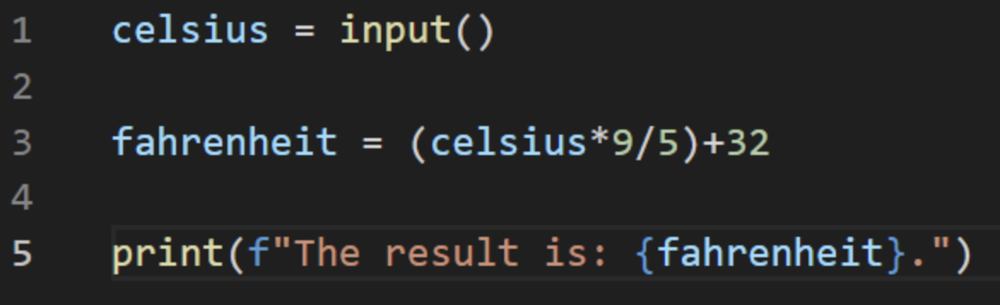

# **Coder Academy - Assignment T1A1 - Workbook: Submitted by Mario Lisbona**

# **Table of contents**

- [**Coder Academy - Assignment T1A1 - Workbook: Submitted by Mario Lisbona**](#coder-academy---assignment-t1a1---workbook-submitted-by-mario-lisbona)
- [**Table of contents**](#table-of-contents)
  - [**Q1 - Web Development Markup Laguages**](#q1---web-development-markup-laguages)
    - [**Tags**](#tags)
    - [**Elements**](#elements)
    - [**Presentational Markup**](#presentational-markup)
    - [**Procedural Markup**](#procedural-markup)
    - [**Descriptive Markup / Semantic Markup**](#descriptive-markup--semantic-markup)
  - [**Q2 - Internet Technologies: Packets, IP, Routers and DNS**](#q2---internet-technologies-packets-ip-routers-and-dns)
    - [Definition - **Packets**](#definition---packets)
    - [Definition - **IP addresses (IPv4 and IPv6)**](#definition---ip-addresses-ipv4-and-ipv6)
    - [Definition - **Routers and Routing**](#definition---routers-and-routing)
    - [Definition - **Domains and DNS**](#definition---domains-and-dns)
    - [Explanation - **Packets**](#explanation---packets)
    - [Explanation - **IP addresses (IPv4 and IPv6)**](#explanation---ip-addresses-ipv4-and-ipv6)
    - [Explanation - **Routers and Routing**](#explanation---routers-and-routing)
    - [Explanation - **Domains and DNS**](#explanation---domains-and-dns)
  - [**Q3 - Internet Technologies: TCP, HTTP/HTTPS and Web Browsers**](#q3---internet-technologies-tcp-httphttps-and-web-browsers)
    - [Definition - **TCP**](#definition---tcp)
    - [Definition - **HTTP and HTTPS**](#definition---http-and-https)
    - [Definition - **Web Browsers (requests, rendering and developer tools)**](#definition---web-browsers-requests-rendering-and-developer-tools)
    - [Explanation - **TCP**](#explanation---tcp)
    - [Explanation - **HTTP and HTTPS**](#explanation---http-and-https)
    - [Explanation - **Web Browsers (requests, rendering and developer tools)**](#explanation---web-browsers-requests-rendering-and-developer-tools)
  - [**Q4 - Python Data Structures**](#q4---python-data-structures)
    - [**Dictionary**](#dictionary)
    - [**List**](#list)
    - [**Set**](#set)
  - [**Q5 - Interpreters and Compilers**](#q5---interpreters-and-compilers)
  - [**Q6 - Pros / Cons of Python and JavaScript**](#q6---pros--cons-of-python-and-javascript)
    - [**Python - Benefits**](#python---benefits)
    - [**Python - Drawbacks**](#python---drawbacks)
    - [**JavaScript - Benefits**](#javascript---benefits)
    - [**JavaScript - Drawbacks**](#javascript---drawbacks)
  - [**Q7 - Ethics and Tech**](#q7---ethics-and-tech)
  - [**Q8 - Control Flow in Python**](#q8---control-flow-in-python)
    - [**Sequential control flow**](#sequential-control-flow)
    - [**Selection control flow**](#selection-control-flow)
    - [**Repetition control flow**](#repetition-control-flow)
      - [**While loop**](#while-loop)
      - [**For loop**](#for-loop)
      - [**Match Case**](#match-case)
  - [**Q9 - Type Coercion and Type Conversion in Python**](#q9---type-coercion-and-type-conversion-in-python)
  - [**Q10 - Data Types**](#q10---data-types)
    - [**Numeric Types**](#numeric-types)
      - [int](#int)
      - [float](#float)
      - [complex](#complex)
    - [**Text Type**](#text-type)
      - [str](#str)
    - [**Boolean Type**](#boolean-type)
      - [bool](#bool)
    - [**Sequnce Type**](#sequnce-type)
      - [tuple](#tuple)
    - [**None Type**](#none-type)
      - [None](#none)
  - [**Q11 - Classes**](#q11---classes)
  - [**Q12 - Find the error in a Code Snippet**](#q12---find-the-error-in-a-code-snippet)
  - [**Q13 - Rewrite a Code Snippet to swap two adjacent elements in an list**](#q13---rewrite-a-code-snippet-to-swap-two-adjacent-elements-in-an-list)
  - [**Q14 - Algorithmic Thinking**](#q14---algorithmic-thinking)
  - [Q15 - Python code using comparison and logical operators](#q15---python-code-using-comparison-and-logical-operators)
  - [**Q16 - ACME Corporation - Coding Competency Application**](#q16---acme-corporation---coding-competency-application)
  - [**References**](#references)

## **Q1 - Web Development Markup Laguages**

**Identify** and **explain** common and important components and concepts of web development markup languages   

### **Tags**

  Tags wrap the element's content. They signal how the content will be displayed as well as the beginning and end point for that particular element. (Erika Varagouli 2021) [^1]

### **Elements**
  
  Tags indicate where an element starts and ends. An element consists of the tags and the content that is enclosed by those tags. (Erika Varagouli 2021) [^2]

### **Presentational Markup**
  
  This is the type of markup used in word processors and is nearly always hidden from the authors, editors and readers of the document. It uses binary codes embedded in documents to affect the text in a process coined WYSIWYG - What You See Is What You Get. (Wikipedia) [^3]

### **Procedural Markup**
  
  With procedural markup, the instructions on how to process the text are embedded in the text itself. Markdown is a great example of this. The document's text is processed from top to bottom and when encountered, the procedural markup is applied to the text it is associated with. (Wikipedia) [^4]

### **Descriptive Markup / Semantic Markup**
  
  This type of markup is used to convey the type of content that is being wrapped by a tag. It helps to convey the purpose of the text being presented.(Erika Varagouli 2021) [^5] Its purpose is to label parts of a document based on what the content is rather than how that content should be presented. (Wikipedia) [^6]

## **Q2 - Internet Technologies: Packets, IP, Routers and DNS**

**Define** the features of the following technologies that are essential in terms of the development of the internet:

### Definition - **Packets**
  
  A packet is the name given to the container that is used to send information around a packet-switched network. It contains two types of information, control information and user data.(Wikipedia) [^7]

### Definition - **IP addresses (IPv4 and IPv6)**
  
  An IP (Internet-Protocol)  address is a unique address that is assigned to any computer or device that is connected to a network. The address is made up of 4 numbers connected (or separated) by full stops. e.g: 142.250.76.100 (MDN) [^8]

### Definition - **Routers and Routing**
  
  Routers are responsible for getting a data packet to its intended destination. Data packets contain the destination IP address amongst other control information. Routing is the process of routers choosing the most efficient path for the data packet to travel on from source to destination.(cisco) [^9]

### Definition - **Domains and DNS**
  
  IP addresses can be easily processed by a computer however they are quite difficult to remember for humans. The domain name is a name given to a web server that is connected to the internet. It is essentially an alias for the underlying IP address used to locate that particular web server. DNS stands for Domain Name System. DNS is similar to a registry or database where a web server's IP address is linked to its domain name. (Mozilla) [^10]

**Explain** how each technology has contributed to the development of the internet.

### Explanation - **Packets**
  
  Packets contributed to the development of the internet by allowing larger chunks of data to be broken up at the server and sent in smaller packets to the user or client. This meant that multiple clients/users could be downloading data from a single website at the same time. This would not be possible if the website had to be downloaded in one large chunk. Having data in small packets rather than large files also makes it easier and more efficient to resend data that is corrupted or lost.(Mozilla) [^11]

### Explanation - **IP addresses (IPv4 and IPv6)**
  
  Without IP addresses the internet wouldn't exist! Every device, whether it's a phone, tablet, PC or web server is assigned an IP address so that it can be located on the internet. The IP address allows the device to send and receive data to/from other devices. It may be allocated an IP address using either IP4, which uses 32bits for its address and IP6 which uses 128bits.(Wikipedia) [^12]

### Explanation - **Routers and Routing**
  
  Routers are an intermediary device and create a network between the sender and the receiver. They will receive data, in the form of packets, from computer A and know which path to send that data so that it reaches its destination at computer B and not at computer C or D. Routers can also link to other routers and this fact allowed for the massive expansion of the internet. Creating a network of networks allows for a theoretical infinite amount of connections between devices on the internet.(Mozilla) [^13]

### Explanation - **Domains and DNS**
  
  With an ever increasing number of web servers on the internet, domains and DNS allowed users to access websites with easy to remember groups of words rather than random numbers separated by full stops. This is facilitated by a type of server called a  DNS server. This is a server that will translate the human readable domain name that is entered by the user into its associated computer readable IP address and will direct the user to the correct web server. Amazon) [^14]

## **Q3 - Internet Technologies: TCP, HTTP/HTTPS and Web Browsers**

**Define** the features of the following technologies that are essential in terms of the development of the internet:

### Definition - **TCP**
  
  The Transmission Control Protocol facilitates the connection between two hosts to allow the guaranteed transmission of data and packets in the correct order to the receiver. (Mozilla) [^15] Its main features are connection control, reliability, flow control and congestion control.(Noction) [^16]

### Definition - **HTTP and HTTPS**
  
  The main features of the Hypertext Transfer Protocol are the client and the server. Requests for information are sent by the client, normally a web browser, to the server. The server then answers the request by sending back information to the client. This is called a response. The client (almost) always is the side sending the request. And the server will then serve the document requested as a response to the client.(Mozilla) [^17]
Hypertext Transfer Protocol Secure (HTTPS) is the same as HTTP except that it has more security that is provided by an SSL certificate and the SSL protocol. SSL stands for Secure Sockets Layer. (Javatpoint) [^18]

### Definition - **Web Browsers (requests, rendering and developer tools)**
  
  A web browser is a piece of software that is used to view or access data on the internet. It sends requests to web servers for data and once it receives the response, it will render the information as a webpage on the user's device. (Wikipedia) [^19]
Developer tools are software add-ons that are included with a browser to allow web developers to inspect, test and debug their code. They work with a few different web technologies including HTML, CSS and JavaScript. (Wikipedia) [^20]

**Explain** how each technology has contributed to the development of client and server communication over the internet *(50 - 150 words for each technology)*.

### Explanation - **TCP**
  
  TCP’s ethos on accuracy over timeliness is one of the reasons it has contributed to the development of client-server communication over the internet. TCP can handle the extended delays in the delivery of packets that are out of order. This could occur if some packets take a different route to their destination or when corrupted packets need to be retransmitted. If timeliness is more important than accuracy then TCP is not the ideal protocol. For applications, like VOIP, that prioritise timeliness over accuracy, then other protocols such as RTP(Real-time transport Protocol) or UDP (User Datagram Protocol) may be better suited.
  
  TCP guarantees that the data received at the client is the exact data sent by the server. It achieves this accuracy using a technique called ‘positive acknowledgement with retransmission’. This technique involves the receiver sending an acknowledgement to the sender once the packet is received. The sender keeps a log of when a packet is sent and a timer that starts when the packet was sent. If a certain amount of time elapses and the sender has not received an acknowledgment yet, it will resend the packet. (Wikipedia) [^21]

### Explanation - **HTTP and HTTPS**
  
  These technologies have hugley contributed to client-server communication because they allow all the devices connected to the network to communicate with each other while not having a permanent connection between the client and the server. The network would be very limited in its size if every device needed a permanent connection to every other device for communication.
  When a connection is needed the client sends a request and the server ‘hears’ the incoming request and the connection is established. The server then waits for the request message from the client. The server's response includes the requested information in a HTTP response. The connection can be closed at any time by either the client or the server. (Wikipedia) [^22]

### Explanation - **Web Browsers (requests, rendering and developer tools)**
  
  Web browsers play a vital part in client server communication. They represent the part of the ‘client’ in client-server communication. Client-server networking is an architecture where information is kept in a central location on servers and is shared with many clients in many different locations. The web browsers part as the client in this architecture is to send the requests for information to the server and accept the responses.
  
  The centralised storage of data on servers allowed numerous clients, or web browsers, to access that data at the same time. In addition to receiving the raw information, the browser also renders that information into a webpage that can be easily viewed on a device. (LifeWire) [^23]
  
  Browsers also have addons called developer tools. These have increased developers productivity by allowing them to directly view a website and edit the code locally to see immediately what changes would result from changing the code whether that be the CSS, HTML or JavaScript. Some other tools that assist developers are the ability to access web-page assets and network usage information such as the bandwidth used to load a page and what headers are being sent and received by the browser. JavaScript debugging within a developer tool suite is also commonly used. (Wikipedia) [^24]

## **Q4 - Python Data Structures**

**Identify** THREE data structures used in the Python programming language and **explain** the reasons for using each.

### **Dictionary**
  
Python dictionaries are collections of data that are stored with key/value pairs where the key is immutable (does not change) and the value is mutable (can be changed). This structure makes it useful for the following reasons:

- If the data that needs to be stored has a unique reference for the key. An example might be a membership ID, telephone number or email address
- If the order that the data is stored is not important
- When timeliness is crucial in relation to accessing a particular element. Dictionaries are designed to allow fast access to particular data based on the unique key because it means the whole database does not need to be scanned to find the right element. (Erdem Isbilen) [^25]  (RealPython) [^26] 

### **List**
  
Python lists are implemented as mutable dynamic arrays. This means that Python lists allow elements to be added and removed. They can store any type of object in python. This makes them highly versatile and the most commonly used data structure in Python and are used for many reasons such as the ones below.

- When a developer needs to store a collection of data that is heterogenous, that is to say when all the data types are different. Python lists can store simple data structures like integers or strings alongside more complex structures like tuples, dictionaries or other lists!
- When the order of the data is important. The order the data is entered into the list is preserved in a list. (Erdem Isbilen) [^27] (RealPython) [^28]

### **Set**
  
Python sets are a data structure similar to a dictionary and a list but has its own unique features. A set is an unordered list of entries. However, unlike a list, a set cannot have duplicate entries and each entry needs to be hashable, that is its value does not change over time. It has a few use cases listed below:

- Checking a set for a value is very fast compared to a list. So if you're looking to store unordered, unique items that have a value that won't change then a set is preferable over a list.
- They are useful for removing duplicates from a series of values
- Sets support mathematical operations being performed on their data. These include intersection, union, difference and symmetric difference. (Python.org) [^29] (Stack overflow) [^30]

## **Q5 - Interpreters and Compilers**

**Describe** the features of *interpreters* and *compilers* and how they are different.

Interpreters and compilers both translate higher level programming languages, or source code, into machine code made up of 0’s and 1’s. Although they have similar features they both use different processes to convert human readable source code into machine readable code.
A compiler will scan the whole program before it translates the source code, as a whole, into machine code. The analysis stage is much longer in duration than that of an interpreter but the overall execution time is faster than interpreters. Compilers require more memory because they create Object Code which requires linking. Common languages that use compilers are C, C++ and Java.
An interpreter will translate a program line by line and will take less time to analyse the source code compared to a compiler. However, it will take more time overal to execute the process. It wont produce any Object Code, so has no need for linking like a compiler, so is more efficient with its memory use. Examples of languages that use interpreters are Python, JavaScript and Ruby. (Programiz) [^31]

## **Q6 - Pros / Cons of Python and JavaScript**

**Identify** TWO commonly used programming languages and **explain** the benefits and drawbacks of each.

### **Python - Benefits**

- Extensive Libraries
  
  Python’s standard library is extensive and comes packed with useful code and functions for regular expressions, documentation-generation, unit-testing, databases, image manipulation and more.

- Extensible and embeddable
  
  Python can be extended to other languages. You can write some of your code, for example, in C or C++.  Complementary to its extensibility, it is also embeddable. This means that python code can be embedded into the source code of other projects, for example, into C++.

- Improved productivity
  
  Python’s extensive libraries give developers access to pre-written functionality that allows them to solve common problems with a few lines of code. This allows more time to be spent on bigger picture problem solving.

- Ease of use and readability
  
  Python’s syntax is less complicated than other languages and it reads much like english, this makes it relatively easy to learn and use.

- Free and Open-Source
  
  Not only is Python free to download and use, but its source code is also available to download, change and distribute.

- Portable
  
  With software written in C or C++ changes may need to be made to make the software run on different platforms. This is not the case with Python as it uses a philosophy called Write Once Run Anywhere(WORA). However developers need to take caution to not use features that are system specific.

- Interpreted rather than compiled
  
  Python’s code is analysed line by line rather than as a whole, which happens in compiled languages. This makes debugging code easier than in compiled languages.

- Object-Oriented
  
  Python supports Object-oriented in addition to procedural programming philosophies. Python's functions help with code reusability. Objects and classes allow developers to model the real world. A class allows developers to combine and encapsulate functions and data.
  
### **Python - Drawbacks**

- Speed limitations

    Because python is interpreted rather than compiled, it executes the code line by line. This can result in slow execution of applications.
- Weak adoption in mobile computing and browsers
  
  Python is popular with server side applications however it is rarely seen used on client side applications because no major web browsers have python built into them. Although python has a framework called Django that can make its interactions with client side applications more streamlined.

- Underdeveloped Database Access Layers
  
  Python's Database Access Layers are fairly undeveloped compared to common technologies like JDBC (Java DataBase Connectivity) and ODBC (Open DataBase Connectivity). This means it has been less readily adopted for larger enterprise projects.

- Design Restrictions - Dynamic Typing
  
  Python is a Dynamically typed language which means that variables are allowed to change over their lifetime and that the interpreter only performs type checking when the code runs. While this is easier and more efficient for the developer when coding it can cause run time issues if the variable types are incorrect. (Data-flair) [^32] (Real Python) [^33]

### **JavaScript - Benefits**

- Speed
  
  As long as no other outside resources are needed, JavaScript runs immediately within the client's browser which makes it very fast to run code. JavaScript also isn't slowed down by calls to a server. All major browsers support Just In Time (JIT) compilation for JavaScript. JIT compilation means the code can be run without it being compiled first.

- Simplicity
  
  JavaScripts syntax is easy to learn and easier to read than other languages like C++

- Popularity
  
  JavaScript is ubiquitous on the web. Its is now becoming more popular as a language to develop applications on servers with the release of Node.js. There is an abundance of projects on Github and StackOverflow that are written in JavaScript and its popularity is only expected to increase.

- Reduces Server Loads
  
  Because javascript is mainly a client side language it greatly reduces the load on servers. There are some cases with smaller applications where a server is not needed at all

- Creation of rich interface
  
  JavaScript has the ability to create a host of features that contribute to webpage useability including drag and drop components and sliders that increase the quality of a user’s experience.

- Versatility
  
  JavaScript, through the use of frameworks and complementary technologies, becomes very versatile. It's possible to create an entire full-stack application with JavaScript. An example of this would be using a Node.js server, bootstrapping Express to Node.js and using MongoDB for a database. In addition to those backend technologies, using JavaScript for the frontend would mean the entire application was created with JavaScript
  
### **JavaScript - Drawbacks**

- Browser interpretations

  Server side scripts will always produce the same result. Different browsers, however, will occasionally interpret JavaScript code differently. These differences aren't huge so problems can be mitigated by testing the application across all the major browsers.

- Client-side Security
  
  Oversights in Javascript code can potentially be exploited by malicious actors because the code is executed within the browser. Because of this design flaw and potential security risk, a lot of people will completely disable JavaScript in their browser. (FreeCodeCamp) [^34]


## **Q7 - Ethics and Tech**

**Identify** TWO ethical issues from the areas below and discuss the extent to which an IT professional is ethically responsible in terms of the issue.

List of topics containing ethical issues:
- access to a user’s personal information (medical, family, financial, personal attributes such as sexuality, religion, or beliefs)
- criminal acts such as theft, fraud, trafficking and distribution of prohibited substances, terrorism
- GPS tracking data and other types of metadata, MAC addresses, hardware fingerprints
- freedom of thought, conscience, speech and the media
- aggressive sales and marketing practices designed to mislead and deceive consumers
- trading of shares on the stock exchange OR crypto-currencies

For each ethical issue identify a source of legal information relating to the ethical issue and discuss whether the law is helpful in assisting a developer to act in an ethical way. *(Word count guide: 200 words max)*

Conduct **research** into a case study of **ONE** of the ethical issues you have chosen **discuss** how an ethical IT professional should respond to the case study and how they might mitigate or prevent ethical breaches. *(Word count guide: 400 - 600 words)*

## **Q8 - Control Flow in Python**

Explain control flow, using examples from the Python programming language

Python’s code executes according to a process known as control flow. This refers to the way python’s code is controlled, either sequentially, by selection or by repetition. Sequentially means the program flows from top to bottom, as a sequence. Selection refers to conditional statements directing a program’s flow. Lastly, repetition is performed by loops. (O’Reilly Media) [^35]

### **Sequential control flow**

This is the process of a program executing its code from top to bottom in a sequence. This limits the code's usefulness and also has the issue that if there is an error at any stage, the execution of the source code will cease. (Buchiredddypalli Koushik) [^36]

### **Selection control flow**

Python makes use of the `if` statement(with its clauses `elif` and `else`) to control the flow of which code is executed based on the result of the condition being evaluated.

When using expressions as the condition for an `if/elif` statement the expression is used in a `boolean` context. If the expression is evaluated as `True` the line or indented block of code will be executed.

Any non-zero, or non-empty data structure will evaluate as truthy (True).  An empty data structure, None or zero of any numeric type will evaluate as falsy (False) in a boolean context within Python. Once the block of code within the `if` statement has been executed, the `if` statement will end.

Single line statements can be placed on the same line as the condition
```py
    If temp < 15: print("It's cold outside")
```

Multiline statements are placed on separate lines after the conditional statement and need to be indent as a block of code
```py
    If temp < 15:
      print("It's cold outside")
      print("It would be a good idea to wear a jacket")
```


If there are other expressions to be evaluated then python has `elif` and `else` that can be used to further control the execution and output. Each `elif` will be executed in sequential order until one evaluates as true. That code will be executed and the `if` statement will end. If no `elif` statements are evaluated as true then the `else` clause can be used to execute code when the `if` or all `elif` statements fail. (O’Reilly Media) - [^37]

### **Repetition control flow**

#### **While loop**

The python statement, while, uses repetition to continually execute a line or block of code for as long as the expression being tested evaluates as true. It is important to include code within the body of the while loop that will eventually make the expression evaluate to false, otherwise the loop will run indefinitely. 

`Break` or `return` statements can be used to exit a while loop.
```py
      counter = 0
      while counter < 5:
        print(counter)
        counter += 1
```
Output:
```py
      0
      1
      2
      3
      4
```

After 4 is printed, the loop tests the condition again and this time it fails so the code is no longer executed.
  (O’Reilly Media) - [^38]
  
#### **For loop**

The `for` loop uses repetition to allow you to execute a line of code many times by iterating (looping through) an iterable. (Career Karma) [^39] An iterable is any Python object that is “capable of returning its members one at a time, permitting it to be iterated over in a for-loop.” Examples of iterables include lists, tuples and strings. (Python like you mean it) [^40]


The `for` loop works by first defining an iterable that you want to loop through. Then creating a variable to hold the value of the current element in the iterable that is being returned. Lastly the code that is to be performed on each loop, on the current value of the variable, is defined. This repetition will be continued until the end of the iterable has been reached.(Dataquest IO) [^41]


In the example below the print statement will be executed on each loop and display the new value for cheese, which will change on each iteration.

```py
  cheese_list = ['Parmigiano', 'Pecorino', 'Bocconcini', 'Treccia']
  for cheese in cheese_list:
      print(cheese)
```

Output:

```py
  Parmigiano
  Pecorino
  Bocconcini
  Treccia
```

If a `break` statement is encountered the loop terminates. However if a `continue` statement is encountered, the current iteration will be terminated and the next iteration will continue.(Python org) [^42]

#### **Match Case**
  
`Match case` was introduced with the release of Python 3.10 The `match case` statement is similar but more powerful version of the `if/else` statement and allows for more complicated pattern matching while requiring less code.

In the example below, a variable `color` is defined and we use the keyword `match` to associate it with cases defined after each keyword `case`. `other` is used in a similar manner to the `else` statement. It can also be written as `case _` (Learn Python) - [^43]
```py
  color = 'red'
  match color:
    case 'red':
      print('Roses are red')
    case 'blue':
      print('Violets are blue')
    case other:
      print('Python is cool')
```
  
## **Q9 - Type Coercion and Type Conversion in Python**

Explain the difference between type coercion and type conversion. Are either of these used in Python?

Type coercion refers to the automatic process of converting one data type to another that is performed by the language being used. Type conversion on the other hand is when the developer manually forces the conversion on a data type.
While Python does not use type coercion, one of the ways it uses type conversion, implicit type conversion, can be easily mistaken for type coercion.
Python uses type conversion in two different ways:
- Implicit type conversion
  - Python will automatically change a data type to avoid data loss
- Explicit type conversion
  - Where a user manually forces a data type to change using built in functions

Below is an example in Python that looks like type coercion but is in fact implicit type conversion
```py
>>> a = 2
>>> b = 5.5
>>> c = a + b
>>> c
7.5
```
In this example the result `c` is a float. Python has not used type coercion to force `a`(int) to become a float to perform the calculation.
It has instead delegated the the responsibility of performing the calculation to both the integer(a) and float(b)    

When Python see’s the addition symbol + it calls the `__add__` method on the left side of the equation and passes the right side of the equation as an argument. So in our example above, the `__add__` method is called on `a` and `b` is passed as an argument. The result is:

```py
>>> a.__add__(b)
NotImplemented
```

`NotImplemented` is a special return value in Python. When the interpreter sees this value it makes an attempt to reverse the way the calculation was previously done and asks `b` if it can add `a` to itself for a result. To perform this python calls the `__radd__` method. The `r` in `__radd_` stands for right hand side. So the equation that is attempted will be:

```py
>>> b.__radd__(a)
7.5
```
So even though this looks like type coercion, it is actually python checking if one object knows how to work with the other. And in this case, b knows how to add a to itself, so a calculation is possible.    

If we look at a similar example with strings it shows how type coercion does not happen in Python.

```py
>>> string = "Mario"
>>> int = 10
>>> string + int
Traceback (most recent call last):
  File "<stdin>", line 1, in <module>
TypeError: can only concatenate str (not "int") to str
```

In languages that use type coercion there would be no error and the resulting string would be `“Mario10”`. This is because ‘under the hood’ the language would coerce `int` to a string and concatenate it to the `string` variable.
In Python this results in an error because it doesn't know how to use the addition operator with an `int` and a `string`.
To make the above example work we would need to use explicit type conversion to convert the `int` to a `string`.
We would do that with the following code:

```py
>>> string + str(int)
'Mario10'
```
(Python Moresels) [^44]

## **Q10 - Data Types**

Explain data types, using examples

There are numerous ways that data can be stored in variables in Python. Data types are a way to categorise and organise the different structures that store information in Python. Below is a list of the most common structures

### **Numeric Types**

#### int

An integer represents a positive or negative whole number (no decimal places). To creat an integer variable we simply assign a whole number to a variable name.

```py
age = 42
```

When creating a variable in this way `42` is referred to as an **integer literal** because we have literally typed into the code.

When using larger whole numbers, python does not allow commas `,` to group numbers into three's as it typically done. However, Python does allow you to use underscores `_` to group numbers together for ease of reading. The two examples below are both valid examples of represening and integer with a valie of 10 million.
```py
>>> 10000000
10000000
>>> 10_000_000
10000000
```

There is no limit of how large an integer can be in Python.  (RealPython) - [^45]

#### float

Floating point numbers or floats, are used for numbers that have decimal points. Floating point literals can be created the same way as integers. There is one extra way a floating point number can be assigned to a variable in python, using the E notation. All 3 ways to create a floating point literal are shown below.
```py
10000000.0
>>> 10_000_000.0
10000000.0
>>> 1e7
10000000.0
>>>
```
In the same way that 0.3 is only an approximation of 1/3 and that 0.33 and 0.333 are both closer and closer approximations of the original fraction, python's base 2 approximation of a floating point base 10 number will never be exact. Python only ever prints a decimal approximation of true  decimal value of the binary approximation stored in memory. If python gave every user the true decmial value of the binary approximation for 1/10 or 0.1, it would look like this:
```py
>>> 0.1
0.1000000000000000055511151231257827021181583404541015625
```
This is too many numbes for anyone to need or to find useful so Python displays a rounded number instead.
```py
>>> 1 / 10
0.1
```
So even though this looks like an exact number, know that the actual value stored is the nearest binary representation on that number. (Python org) [^46]


#### complex

One of pythons strengths is its handling of numbers and math in the domains of scientific computing and computer graphics. Python has a data type that handle complex numbers that are often used in precalculus and higher-level algebra. A complex numbers has two parts, a **real** part and an **imaginary** part. To create a complex number we seperate the real and imaginary parts of the complex number with a plus and a traling j, like below.

```py
>>> n = 1 + 2j
```
All arithmetic operations, except for floor division, that can be used on integers and floats can be used on complex numbers.

### **Text Type**

#### str

Strings are immutable (unchangeable) sequences of Unicode characters. String literals can be created in 3 different ways. For example:

  - Single quotes: 'Outer single quotes allows for embedded "double" quotes'
  - Double quotes: "Outer double quotes allows for embedded 'single' quotes"
  - Triple quoted: '''Three single quotes''', """Three double quotes""" (Python org) [^47]

strings are a squence of ordered characters starting with a zero index. Each character in the sequence can be accessed by its index number. Python supports negative indexing as shows below:

```py
>>> name = 'Mario Lisbona'
>>> name
'Mario Lisbona'
>>> name[0]
'M'
>>> name[3]
'i'
>>> name [-1]
'a'
```

As i have mentioed, string are immutable so none of the elements in the sequence are able to be changed.

```py
>>> name = 'Mario Lisbona'
>>> name
'Mario Lisbona'
>>> name[0]
'M'
>>> name[6] = 'l'
Traceback (most recent call last):
  File "<stdin>", line 1, in <module>
TypeError: 'str' object does not support item assignment
```

### **Boolean Type**

#### bool

Python 3 has a Boolean data type. Objects that are of a Boolean type can be either True or False.
Python expressions are often evaluated in a Boolean context. This gives rise to the expressions of "truthy" and "falsey". Obviously the boolean expressions True and False represent theie counterparts of truthy and falsey but non-boolean objects can also be expressed as being truthy or falsey.

Boolean aer considered numeric in Python. As such, they can be used for arithmetic oepations and can be compared to numbers. This is where truthy and falsey come into play for non boolean objects. Any non-zero object will be considered truthy. And any zero object, empty sequence or collection or None objects will be considered falsey. (FreeCodeCamp) [^48]

```py
>>> list_a = []
>>> list_b = [1,2,3,4,5]
>>> bool(list_a)
False
>>> bool(list_b)
True

>>> str_a = ''
>>> str_b = "Im a string"
>>> bool(str_a)
False
>>> bool(str_b)
True
>>> bool(None)
False
```

### **Sequnce Type**

#### tuple

Tuples are similar to lists in that they are a sequence of ordered data however they differ because of the fact that tuples are immutable, they cannot be changed. Tuples are indexed and the elements are accessed in a similar way to a list but rather use () instead of [] with the index number. (Tutorialspoint) [^49]

Tuples are also created in a similar way to lists but use () instead of [] and accessing the elements is the same as list Below are examples of creating and accessing tuples.

```py
>>> tuple_1 = ('Nissan', 'Toyota', 2010, 2022)
>>> tuple_2 = (1, 2, 3, 4, 5)
>>> tuple_1[1]
'Toyota'
>>> tuple_2[4]
5
```
The example belows demostrates that tuple are an immutable dta type:

```py
>>> tuple_1 = ('Nissan', 'Toyota', 2010, 2022)
>>> tuple_2 = (1, 2, 3, 4, 5)
Traceback (most recent call last):
  File "<stdin>", line 1, in <module>
TypeError: 'tuple' object does not support item assignment
```

However tuples can be added together to creat new tuples:

```py
>>> tuple_1 = ('Nissan', 'Toyota', 2010, 2022)
>>> tuple_2 = (1, 2, 3, 4, 5)
>>> tuple_3 = tuple_1 + tuple_2
>>> tuple_3
('Nissan', 'Toyota', 2010, 2022, 1, 2, 3, 4, 5)
```

Although tuples are very similar to lists they are the prefered data type if you know that your data will not change over time. When comaring a list and a tuple that contain exactly the same data, a tuple will require less memory that a list. This may make it a better option if memory use is a major factor in design. (Erdem Isbilen) [^50] See example below that shows a tuple taking up less memory than a list.

```py
>>> import sys
>>> example_tuple = ('Mario', 'Lisbona', 42, 1979, 'Male')
>>> example_list = ['Mario', 'Lisbona', 42, 1979, 'Male']
>>> print(sys.getsizeof(example_tuple))
80
>>> print(sys.getsizeof(example_list))
104
```

Tulpes also have slightly faster access times that lists. This may also be a consideration when choosing between a ist and a tuple for storing ordered data.

### **None Type**

#### None

Python uses the keyword `None` to define null or empty obejcts are variables. It does all the same things that `Null` does in other languages though its used entirely differntly in Python.`None` is not defined as zero or any other value, in Python `None` is an object and treated as a first class citizen.

None is the value that is returned by all functions when there is no return statement:

```py
>>> def func_with_no_return():
...     pass
...
>>> func_with_no_return()
>>> print(func_with_no_return())
None
```

We can see in the above example from the python REPL `func_with_no_return()` has no return statement so it returns None. This is not immedietly evident if we only call the function - nothing is printed to sreen. If we use `print()` to print then we see that `None` is in fact being returned. (RealPython) [^51]

None is so widely used in Python that unless it is explicitly asked to be printed, the Python REPL wont print `None`

Below is an example using `None` in Python to address the mutable default argument issue.

The function below appends a name to a list and works as normal when passing a list that has already been initialsed with data.

```py
>>> def add_name(name, people=[]):
...     people.append(name)
...     return people
...
>>> people = ['Mario', 'Ali', 'John', 'Denise']
>>> add_person('Alana', people)
['Mario', 'Ali', 'John', 'Denise', 'Alana']
>>>
```

However if we call add_name numerous times with a default argument and each time its called assign the value to a new variable we will get an unexpected result.

```py
>>> x = add_person('Jon')
>>> print(x)
['Jon']
>>> y = add_person('Snow')
>>> print(y)
['Jon', 'Snow']
>>> z = add_person('Daenerys Targaryen')
>>> print(z)
['Jon', 'Snow', 'Daenerys Targaryen']
```

We would assume that this would create a new list each time the function is called and that new list assigned to a new variable. Its clear in the above example that this is not happening. Once the list is defined, in the first function call, that same list is used in any subsequent calls of `add_name()`.

We can use `None` as the default argument. Once we are inside the function we can use the `if` statement to check whether the user has entered a list as an argument or has left it to the default.

```py
>>> def add_person(name, people=None):
...     if people is None:
...             people = []
...     people.append(name)
...     return people
...
>>> x = add_person('Jon')
>>> print(x)
['Jon']
>>> y = add_person('Snow')
>>> print(y)
['Snow']
>>> z = add_person('Daenerys Targaryen')
>>> print(z)
['Daenerys Targaryen']
```

As you can see this is the output we expected in the previous example. (Pythontutorial) [^52]

## **Q11 - Classes**

Here’s the problem: “There is a restaurant serving a variety of food. The customers want to be able to buy food of their choice. All the staff just quit, how can you build an app to replace them?”
- Identify the classes you would use to solve the problem
- Write a short explanation of why you would use the classes you have identified

## **Q12 - Find the error in a Code Snippet**

Identify and explain the error in the code snippet below that is preventing correct execution of the program

<br>



<br>

This code results in a TypeError.


In this code, on line 2, the input() function will return a string and assign it to the celsius variable. The error is occurring on line 3 where there is a math calculation being attempted on two data types that are unsupported - between a string and a number.


## **Q13 - Rewrite a Code Snippet to swap two adjacent elements in an list**

The code snippet below looks for the first two elements that are out of order and swaps them; however, it is not producing the correct results. Rewrite the code so that it works correctly.

<br>


<br>

```py
# creating the list of numbers
arr = [5, 22, 29, 39, 19, 51, 78, 96, 84]

# printing the list of numbers
print("Original list\t", arr)

# Setting i to the value of 0 - the first element of the list
# iterating over the elments in the list while the i is less than the length of the list - 1 (zero index)
# and the while the current element's value is less than the next element's value.
i = 0
while ( i < len(arr) - 1) and (arr[i] < arr[i + 1]):
    # while true increment i
    i +=1
# I've left this in but all it does it print out the last index that is reached befre the while loop fails
print(i)

# Swap the current element with the next element
arr[i], arr[i + 1] = arr[i + 1], arr[i]

# printing the new list with the first two elements that are out of order now put in order
print("New list\t", arr)
```

**Output**

```
Original list    [5, 22, 29, 39, 19, 51, 78, 96, 84]
3
New list         [5, 22, 29, 19, 39, 51, 78, 96, 84]
```


## **Q14 - Algorithmic Thinking**

Demonstrate your algorithmic thinking through completing the following two tasks, in order:
1. Create a flowchart to outline the steps for listing all prime numbers between 1 and 100 (inclusive). Your flowchart should make use of standard conventions for flowcharts to indicate processes, tasks, actions, or operations
2. Write pseudocode for the process outlined in your flowchart

## Q15 - Python code using comparison and logical operators

Write pseudocode OR Python code for the following problem:

*You have access to two variables: raining (boolean) and temperature (integer). If it’s raining and the temperature is less than 15 degrees, print to the screen “It’s wet and cold”, if it is less than 15 but not raining print “It’s not raining but cold”. If it’s greater than or equal to 15 but not raining print “It’s warm but not raining”, and otherwise tell them “It’s warm and raining”*.

```py
def rain_temp(raining, temperature):
    """
    This functions prints out a different message depending on whether its raining or not and what the temperature is.

    Args:
        raining (Bool): true of false pool - whether its raining or not.
        temperature (int): The temperature in degrees.
    """    
    if raining and temperature < 15:
        print("\nIt's wet and cold")
    elif not raining and temperature < 15:
        print("\nIt's not raining but cold")
    elif not raining and temperature >= 15:
        print("\nIt's warm but not raining")
    else:
        print("\nIt's warm and raining")    

rain_temp(True, 14)
rain_temp(False, 14)
rain_temp(False, 15)
rain_temp(True, 46)
rain_temp(False, 46)
```

**Output**

```
It's wet and cold

It's not raining but cold

It's warm but not raining

It's warm and raining

It's warm but not raining
```


## **Q16 - ACME Corporation - Coding Competency Application**

ACME Corporation are hiring a new junior developer, as part of their hiring criteria they've created a "coding skill score" based on the specific competencies they require for this role; the more important the skill is for ACME corp, the more points it contributes to the "coding skill score" The skills are weighted as follows:
- Python (1)
- Ruby (2)
- Bash (4)
- Git (8)
- HTML (16)
- TDD (32)
- CSS (64)
- JavaScript (128)

Write a program that allows a user to input their skills and then tells them :

 a) Their overall "coding skill score"


 b) Skills they may want to learn, and how much each one would improve their score


 ## **References**

- [^1 - Tags](#tags) - https://www.semrush.com/blog/markup-language/
- [^2 - Elements](#elements) - https://www.semrush.com/blog/markup-language/
- [^3 - Presentational Markup](#presentational-markup) - https://en.wikipedia.org/wiki/Markup_language
- [^4 - Procedural Markup](#procedural-markup) - https://en.wikipedia.org/wiki/Markup_language
- [^5 - Descriptive Markup / Semantic Markup](#descriptive-markup--semantic-markup) - https://www.semrush.com/blog/markup-language/
- [^6 - Descriptive Markup / Semantic Markup](#descriptive-markup--semantic-markup) - https://en.wikipedia.org/wiki/Markup_language
- [^7 - Definition - Packets](#definition---packets) - https://en.wikipedia.org/wiki/Network_packet
- [^8 - Definition - IP addresses (IPv4 and IPv6)](#definition---ip-addresses-ipv4-and-ipv6) - https://developer.mozilla.org/en-US/docs/Learn/Common_questions/How_does_the_Internet_work
- [^9 - Definition - Routers and Routing](#definition---routers-and-routing) - https://www.cisco.com/c/en/us/solutions/small-business/resource-center/networking/what-is-a-router.html
- [^10 - Definition - Domains and DNS](#definition---domains-and-dns) - https://developer.mozilla.org/en-US/docs/Learn/Common_questions/What_is_a_domain_name 
- [^11 - Explanation - Packets](#explanation---packets) - https://developer.mozilla.org/en-US/docs/Learn/Getting_started_with_the_web/How_the_Web_works#packets_explained
- [^12 - Explanation - IP addresses (IPv4 and IPv6)](#explanation---ip-addresses-ipv4-and-ipv6) - https://en.wikipedia.org/wiki/IP_address
- [^13 - Explanation - Routers and Routing)](#explanation---routers-and-routing) - https://developer.mozilla.org/en-US/docs/Learn/Common_questions/How_does_the_Internet_work
- [^14 - Explanation - Domains and DNS)](#explanation---domains-and-dns) - https://aws.amazon.com/route53/what-is-dns/
- [^15 - TCP](#question-3---internet-technologies-tcp-httphttps-and-web-browsers) - https://developer.mozilla.org/en-US/docs/Glossary/TCP)
- [^16 - TCP](#question-3---internet-technologies-tcp-httphttps-and-web-browsers) - https://www.noction.com/blog/tcp-transmission-control-protocol-congestion-control#:~:text=The%20main%20TCP%20features%20are,for%20creating%20multiple%20virtual%20connections.
- [^17 - HTTP and HTTPS](#question-3---internet-technologies-tcp-httphttps-and-web-browsers) - https://developer.mozilla.org/en-US/docs/Web/HTTP/Overview#basic_aspects_of_http
- [^18 - HTTP and HTTPS](#question-3---internet-technologies-tcp-httphttps-and-web-browsers) - https://www.javatpoint.com/http-vs-https
- [^19 - Web Browsers](#question-3---internet-technologies-tcp-httphttps-and-web-browsers) - https://en.wikipedia.org/wiki/Web_browser
- [^20 - Web Browsers](#question-3---internet-technologies-tcp-httphttps-and-web-browsers) - https://en.wikipedia.org/wiki/Web_development_tools
- [^21 - TCP](#question-3---internet-technologies-tcp-httphttps-and-web-browsers) - https://en.wikipedia.org/wiki/Transmission_Control_Protocol#Network_function
- [^22 - HTTP and HTTPS](#question-3---internet-technologies-tcp-httphttps-and-web-browsers) - https://en.wikipedia.org/wiki/Hypertext_Transfer_Protocol#Request_and_response_messages_through_connections
- [^23 - Web Browsers](#question-3---internet-technologies-tcp-httphttps-and-web-browsers) - https://www.lifewire.com/web-browsers-and-web-servers-communicate-817764
- [^24 - Web Browsers](#question-3---internet-technologies-tcp-httphttps-and-web-browsers) - https://en.wikipedia.org/wiki/Web_development_tools
- [^25 Data Structures: Dictionary](#dictionary) - https://towardsdatascience.com/python-dictionaries-651acb069f94
- [^26 Data Structures: Dictionary](#dictionary) - https://realpython.com/python-data-structures/#dictionaries-maps-and-hash-tables
- [^27 Data Structures: List](#list) - https://towardsdatascience.com/a-complete-guide-to-python-lists-6b592c8d5707
- [^28 Data Structures: List](#list) - https://realpython.com/python-data-structures/#list-mutable-dynamic-arrays
- [^29 Data Structures: Set](#set) - https://docs.python.org/3/tutorial/datastructures.html#sets
- [^30 Data Structures: Set](#set) - https://stackoverflow.com/questions/3489071/in-python-when-to-use-a-dictionary-list-or-set
- [^31 Interpreters and Compilers](#question-5---interpreters-and-compilers) - https://www.programiz.com/article/difference-compiler-interpreter
- [^32 Python pros / cons](#python---drawbacks) - https://data-flair.training/blogs/advantages-and-disadvantages-of-python/
- [^33 Python pros / cons](#python---drawbacks) - https://realpython.com/lessons/dynamic-vs-static/
- [^34 JavaScript pros / cons](#javascript---drawbacks) - https://www.freecodecamp.org/news/the-advantages-and-disadvantages-of-javascript/
- [^35 Control Flow in Python](#question-8---control-flow-in-python) - https://www.oreilly.com/library/view/python-in-a/0596001886/ch04s09.html
- [^36 Sequential Control Flow in Python](#sequential-control-flow) - https://www.educative.io/answers/what-are-control-flow-statements-in-python
- [^37 Selection Control Flow in Python](#selection-control-flow) - https://www.oreilly.com/library/view/python-in-a/0596001886/ch04s09.html
- [^38 While loop in Python](#while-loop) - https://www.oreilly.com/library/view/python-in-a/0596001886/ch04s09.html
- [^39 For in Python](#for-loop) - https://careerkarma.com/blog/python-for-loop/
- [^40 For loop in Python](#for-loop) - https://www.pythonlikeyoumeanit.com/Module2_EssentialsOfPython/Iterables.html 
- [^41 For loop in Python](#for-loop) - https://www.dataquest.io/blog/python-for-loop-tutorial/ 
- [^42 For loop in Python](#for-loop) - https://docs.python.org/3/reference/compound_stmts.html#the-for-statement
- [^43 Match Case in Python](#match-case) - https://learnpython.com/blog/python-match-case-statement/
- [^44 Type coercion and Type Conversion in Python](#question-9---type-coercion-and-type-conversion-in-python) - https://www.pythonmorsels.com/type-coercion/#:~:text=Many%20programming%20languages%20have%20something,does%20not%20have%20type%20coercion.
- [^45 - Integers](#integer) - https://realpython.com/python-numbers/
- [^46 - Floating point numbers](#floating-point-numbers) - https://realpython.com/python-numbers/
- [^47 - Strings](#strings) - https://docs.python.org/3/library/stdtypes.html#str
- [^48 - Boolean Type](#bool) - https://www.freecodecamp.org/news/truthy-and-falsy-values-in-python/#:~:text=Falsy%20values%20are%20values%20that,type%2C%20None%20%2C%20and%20False%20.
- [^49 - tuple](#tuple) - https://www.tutorialspoint.com/python/python_tuples.htm
- [^50 - tuple](#tuple) - https://www.tutorialspoint.com/python/python_tuples.htm
- [^51 - None](#none) - https://realpython.com/null-in-python/
- [^52 - None](#none) - https://www.pythontutorial.net/advanced-python/python-none/


 [Go to top of page](#coder-academy---assignment-t1a1---workbook-submitted-by-mario-lisbona)